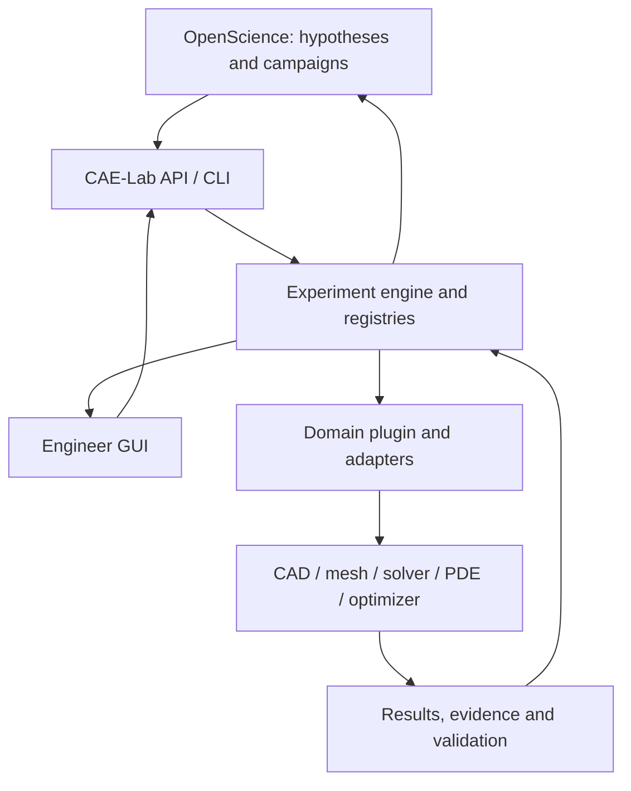

# Architecture

## Control flow

OpenScience selects research questions, variables and campaign strategy and interprets summarized outcomes. CAE-Lab makes immutable experiments, applies gates, invokes typed adapters and returns solver-independent results. A deterministic numerical engine owns parameter generation and search. Domain plugins supply engineering meaning and checks. Adapter internals own Code_Aster commands, OpenRadioss cards, FreeCAD property APIs, UFL forms and optimizer input files. GUI and headless flows use the same revision and artifact IDs. `apps/lab/` adds a thin common local surface; the retained upstream fixture GUI remains its original CAD application.

## Boundaries and contracts

`schemas/experiment.schema.json` and `schemas/result.schema.json` define versioned JSON envelopes. `caelab.schema` validates them again in Python. Executable Core operations include study/parameter/CAD/analysis/inspection/DOE, `plan_optimization`, `run_optimization`, `inspect_optimization` and `run_pde`. Standalone generic `mesh` remains a future capability. PDE and optimization have bounded adapter capabilities rather than universal backend coverage. OpenScience uses registered research IDs and declared mathematics, without native CAD paths or solver syntax. Unimplemented operations return explicit capability errors.

A registry entry maps `parameter_id` to an adapter-owned native reference (`backend`, `document`, `object`, `path`) with unit, type, bounds, fixed/free, dependency references, source, revision and geometry-effect evidence. Only explicit registration promotes a discovery candidate into a research variable. The adapter verifies that a candidate is writable and influences the final model where the backend permits. Core checks types, bounds and fixed values before CAD work, and validates dependency references at registration. Adapter-owned expressions and model relations are checked during CAD regeneration; Core does not evaluate arbitrary CAD formulas.

`CADAdapter.document_id(model)` supplies the stable native document identity for registry selection. This keeps `.py` source names and FCStd design IDs inside their adapters. Editing that source invalidates mappings until `parameters.refresh` rechecks their effect and writes a new registry revision.

`AnalysisAdapter.solve(parent_result, parent_root, output, settings)` operates on a finished CAD experiment. Core verifies the parent ledger and artifact hashes, then writes a separate child proposal/result/ledger with the same CAD revision. The adapter selects the native exchange artifact and owns meshing, solver deck and result parsing. The first `fixture.calculix` screen is limited to the roller support's validated saddle geometry and illustrative load case. See ADR 0002 and `docs/STRUCTURAL_SCREEN.md`.

`DOEAdapter.sample(registered_variables, count, seed)` owns numerical point generation. `plan_doe` freezes every point and registry/source/adapter identity before execution; `run_doe` reuses the CAD and analysis Core operations with one journal checkpoint per point. The first SciPy Latin hypercube adapter handles continuous variables only, and invalid CAD points have no solver child. Engine choice, rather than solver-specific syntax, is exposed to OpenScience. See ADR 0003 and `docs/DOE_CAMPAIGNS.md`.

`OptimizationAdapter.describe/run` owns adaptive candidate generation and public
numerical-engine settings. Core freezes source/registry/plugin identity,
objective/constraint source and units, required numerical checks and failure
policy. It evaluates candidates through the existing CAD/analysis operations,
persists exact journals/checkpoints and resumes by deterministic evaluation
replay. Invalid observations never become an incumbent. See ADR 0005 and
`docs/OPTIMIZATION.md`.

`PDEAdapter.solve(output, settings)` operates on a declared mathematical model
without a fictitious CAD parent. `run_pde` uses the common experiment/result
envelope, model-revision extension and checked evidence/artifact ledger. The
first FEniCSx adapter owns its bounded AST-to-UFL translation and separate
system-Python process. Canonical error and convergence evidence remain distinct
from physical qualification. See ADR 0006 and `docs/PDE_ACCEPTANCE.md`.

`ModelAnalysisAdapter.solve(output, settings)` extends the same declared-model
Core to independent geometry/material/load models. Optional pure
`describe_model` supplies common geometry, materials, boundaries, loads and
fields. `run_model_analysis` hashes that declaration with settings and writes
optional common `model_revision`; historical PDE hashes/envelopes remain valid.
PDE delegates to this shared implementation. The independent elasticity plugin
owns the analytical reference; its Code_Aster adapter owns native syntax/tables.
Real CAD-parent analyses still use their verified parent. See ADR 0007.

Execution order: proposal → parameter checks → CAD regeneration → geometry/domain/manufacturing/interface checks → mesh and solver preflight → simulation → numerical/engineering checks → evidence and decision. A FAIL in a blocking gate suppresses later work. An UNKNOWN blocking release requirement prevents `RELEASED`; it does not fabricate a FAIL or PASS. The Phase 1 CAD-only operation stops before mesh and returns `NOT_RELEASED` even if its CAD checks pass.

Each validation record has `validator`, `type`, `status` (`PASS`, `FAIL`, `UNKNOWN`, `WARNING`), `blocking`, threshold/expected, timestamp, evidence IDs and related revision/run. Evidence is a distinct observation, with metric/value/unit/method/source/artifact linkage. Result metrics contain values and explicit validity or reason; an absent FEA metric is never zero. An artifact record includes relative path, SHA-256, byte size, MIME and revision. The experiment manifest links study/hypothesis → proposal → registry snapshot → CAD revision → artifacts/evidence/validations → decision; future mesh, deck, solver and physical-test nodes extend the same thread.

The experiment store is append-only by experiment ID. Each run writes a new directory, never overwrites a prior result. Artifact paths remain relative to their experiment root; hashes are verified when inspected. A separate same-store ledger checks result/thread hashes for accidental edits; this is not a signed archive against an actor who can edit the entire store. Core and plugin commits, source tree hash, adapter version, Python/runtime, model source hash, input hash, optional solver/material/mesh/seed and execution settings form provenance. Secrets and entire environment dumps are excluded.

## Adapters and plugins

Core has CAD, preprocessor, structural solver, PDE, postprocessor, optimizer and future physical-test protocol slots. `FixtureCadQueryAdapter` delegates to the pinned `auto-fixture-design` implementation. `FixtureFreeCADAdapter` wraps its inspect/register/generate worker and FCStd in an isolated child process; the Core bridge passed historical [FreeCAD CI acceptance](https://github.com/pikachu444/autonomous-cae-lab/actions/runs/36632876593) and the primary Windows/WSL local restoration. See `docs/LOCAL_EXECUTION.md`. Fixture-specific checks stay in the upstream plugin, not in `caelab`.

Candidates for later stages: Code_Aster with SALOME-MECA GUI for nonlinear implicit, CalculiX/PrePoMax as alternatives, OpenRadioss for explicit, FEniCSx for weak-form research, GetDP/Gmsh for GUI formulation, MOOSE for larger multiphysics, MFront/MTest for constitutive verification, DAKOTA for black-box DOE/UQ, OpenMDAO for MDO, pymoo for multiobjective and PETSc TAO/MOOSE for PDE-constrained work. A candidate becomes an adapter only after an executable benchmark and source-backed capability/license check. See `docs/BACKEND_EVALUATION.md`.

## GUI and physical experiments

`apps/lab/` exposes Research/Design/Simulation/Explore/Results through public
Core calls. Single-writer jobs execute in the selected new local store;
explicitly configured historical libraries are read only. Catalog rows state
that bytes have not been verified; actual result inspection/download verifies
Core ledger/artifact hashes and safe contained paths. Report exports retain
invalid metrics, independent checks/UNKNOWN, exact revisions and raw evidence
with necessary CAD parents. Portable ZIP integrity is not a signed or remote
archive. ADR 0008 and `apps/lab/CONTRACT.md` specify the transport boundary.

The upstream fixture browser edits source or native CAD and downloads editable
artifacts. The Lab surface serves its pinned native viewer for verified surface
artifacts rather than replacing its CAD implementation. Stored source/FCStd
and STEP/STL/3MF retain the same experiment revision. Physical measurement,
calibration, fabrication and machine evidence stay `UNKNOWN` until measured.

## OpenScience transport

`openscience/contract.md` fixes operation names, JSON input/output and failure
semantics. The actual stdio MCP bridge uses the same Core. Task-owned local
OpenScience 2.0.146 has made real study/registry calls; whole live research-loop
acceptance remains unverified. Failed/partial attempts are retained in
CONNECTED_CONTINUATION. Permissions, sandbox availability, traces/endpoints and
company-data policy remain explicit; transport or tool completion is not a
research/numerical approval.

## Parallel research

Independent agents may research candidate backends or verify tests. One owner changes each common schema/API/registry at a time; another reviewer checks boundary leakage, benchmark evidence and failure handling. Accepted/rejected decisions and evidence land in an ADR or research note. The root integrator owns cross-domain consistency and end-to-end acceptance.
