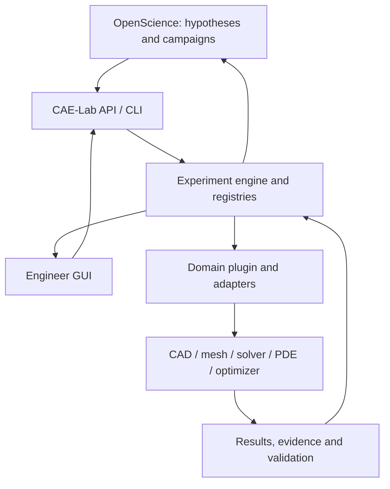

# Architecture

## Preserved Maxwell material-point source (ADR0028)

The synthetic one-branch viscoelastic Domain and adapter reuse the existing
model-analysis boundary. Core stores declared revisions, append-only experiments
and validations; Domain owns independent history/stress/tangent/energy verdicts;
the adapter owns actual MGIS/MTest buffers, generated law/build/runtime evidence
and common owned execution. Shared compiler behavior names are explicit trusted
constants. Execution reliability and numerical acceptance are separate. Source
review/cold proof does not qualify native behavior, measured material or release.
MaterialPoints remains SVK-only until fresh Maxwell native and explicit Research
admission gates. Deterministic engines retain numerical search ownership.

## Explicit material-point research (ADR0027)

MaterialPoints/schema4 admits only the qualified bounded SVK adapter through
the six existing model-analysis study/inspection/comparison tools. Core31 tools,
Domain physics, adapters/native syntax and deterministic numerical engines retain
their owners. Old research scopes/provider/auth/default/Stop remain. The current
summary offers validation/error metrics and original artifact references rather
than full measured F/P/A/W histories. Source admission and actual connected
question/GUI/Stop are separate gates; physical/FE release remains UNKNOWN.

## Explicit PDE research and retained native field views (ADR0024)

OpenScience gets an optional PDEFields scope with six existing operations,
case-sensitive descriptor and explicit resource limits. Old scopes/model/auth
remain. The human Results view reads same-record manifested native fields
through the existing verified artifact API; it does not evaluate scientific
acceptance. Domain/Core verdicts, numerical engines and adapter/native syntax
retain their owners. Reviewed source and old-native consumption are separate
from clean-source actual Research/GUI and engineering qualification. See
ADR/0024-bounded-pde-research-field-inspection.md and the D3.6 record.

## Control flow

OpenScience selects research questions, variables and campaign strategy and interprets summarized outcomes. CAE-Lab makes immutable experiments, applies gates, invokes typed adapters and returns solver-independent results. A deterministic numerical engine owns parameter generation and search. Domain plugins supply engineering meaning and checks. Adapter internals own Code_Aster commands, OpenRadioss cards, FreeCAD property APIs, UFL forms and optimizer input files. GUI and headless flows use the same revision and artifact IDs. `apps/lab/` adds a thin common local surface; the retained upstream fixture GUI remains its original CAD application.

## Boundaries and contracts

`schemas/experiment.schema.json` and `schemas/result.schema.json` define versioned JSON envelopes. `caelab.schema` validates them again in Python. Executable Core operations include study/parameter/CAD/analysis/inspection/DOE, `plan_optimization`, `run_optimization`, `inspect_optimization` and `run_pde`. Standalone generic `mesh` remains a future capability. PDE and optimization have bounded adapter capabilities rather than universal backend coverage. OpenScience uses registered research IDs and declared mathematics, without native CAD paths or solver syntax. Unimplemented operations return explicit capability errors.

A registry entry maps `parameter_id` to an adapter-owned native reference (`backend`, `document`, `object`, `path`) with unit, type, bounds, fixed/free, dependency references, source, revision and geometry-effect evidence. Only explicit registration promotes a discovery candidate into a research variable. The adapter verifies that a candidate is writable and influences the final model where the backend permits. Core checks types, bounds and fixed values before CAD work, and validates dependency references at registration. Adapter-owned expressions and model relations are checked during CAD regeneration; Core does not evaluate arbitrary CAD formulas.

`CADAdapter.document_id(model)` supplies the stable native document identity for registry selection. This keeps `.py` source names and FCStd design IDs inside their adapters. Editing that source invalidates mappings until `parameters.refresh` rechecks their effect and writes a new registry revision.

`AnalysisAdapter.solve(parent_result, parent_root, output, settings)` operates on a finished CAD experiment. Core verifies the parent ledger and artifact hashes, then writes a separate child proposal/result/ledger with the same CAD revision. The adapter selects the native exchange artifact and owns meshing, solver deck and result parsing. The first `fixture.calculix` screen is limited to the roller support's validated saddle geometry and illustrative load case. See ADR 0002 and `docs/STRUCTURAL_SCREEN.md`.

`DOEAdapter.sample(registered_variables, count, seed)` owns numerical point generation. `plan_doe` freezes every point and registry/source/adapter identity before execution; `run_doe` reuses the CAD and analysis Core operations with one journal checkpoint per point. The first SciPy Latin hypercube adapter handles continuous variables only, and invalid CAD points have no solver child. Engine choice, rather than solver-specific syntax, is exposed to OpenScience. See ADR 0003 and `docs/DOE_CAMPAIGNS.md`.

`OptimizationAdapter.describe/run` owns adaptive candidate generation and public
numerical-engine settings. Core freezes source/registry/plugin identity,
objective/constraint source and units, required numerical checks and failure
policy. It evaluates candidates through the existing CAD/analysis operations,
persists exact journals/checkpoints and resumes by deterministic evaluation
replay. Invalid observations never become an incumbent. See ADR 0005 and
`docs/OPTIMIZATION.md`.

`PDEAdapter.solve(output, settings)` operates on a declared mathematical model
without a fictitious CAD parent. `run_pde` uses the common experiment/result
envelope, model-revision extension and checked evidence/artifact ledger. The
first FEniCSx adapter owns its bounded AST-to-UFL translation and separate
system-Python process. Canonical error and convergence evidence remain distinct
from physical qualification. See ADR 0006 and `docs/PDE_ACCEPTANCE.md`.
An optional pure PDE `describe_model`, explicitly enabled by the adapter's
`pde_model_declaration = True`, uses the same declaration boundary
as other independent models: settings plus declaration determine its revision,
and common proposal fields record geometry, boundaries, sources and outputs.
All other PDE adapters retain the historical settings-only revision, including
legacy adapters that already expose a shared `describe_model` method.
The nonlinear scalar plugin owns its scientific checks; native Newton policy
and UFL remain in its adapter, with no new Core equation or solver logic.

ADR0019 adds `pde.fenicsx.rectangle` through the same operation and explicit
declaration opt-in. The elliptic Domain plugin owns declared rectangle/named
Dirichlet-Neumann conditions and reference verdicts; the adapter retains actual
native topology/boundary fields and reuses the accepted AST helper and owned
process cancellation. Legacy PDE sources/revisions remain.
ADR0020 adds transient scalar rectangles with bounded time expressions,
initial conditions and complete N+1 histories. ADR0021 adds real two-component
Lamé-type vector forms with directed D/traction, blocked native DOFs and
component plus aggregate reference checks. Both reuse the same explicit model
declaration/Core/Results/artifact ledger. Domain owns scientific meaning and
verdicts; adapters own native forms/fields/residuals. Vector source is integrated;
transient exact-source CI and independent field audit supply bounded mathematical
evidence. Vector6c actual native solve retains numerical REJECTED because the
fixed first-pair L2 rate fails; source integration does not qualify that case.
ADR0022 adds two scalar coupled fields/material interfaces through the same
operation: SPD diffusion acts on component rows, common PSD reaction and
conforming regional dx/split exterior ds retain both interface input traces.
The adapter owns native cell/segment tags, actual internal left/right adjacency,
blocked fields, Constants, solved-vector residual and isolated source transport.
Domain owns coefficients/declared boundaries/reference/verdicts. Root's narrow
geometry-only _mesh_topology extraction is independently reviewed and passes
169 legacy checks; actual scalar responses/side checks remain. No artificial
interface load or zero pointwise P1 flux-jump acceptance is added. Imported/MPI,
coupled native qualification, guarded Research and native-field GUI stay open;
physical UNKNOWN/NOT_RELEASED is unchanged.

ADR0023 adds `pde.fenicsx.imported` through the same explicit declaration/Core/
Results/ledger operation. Adapter syntax owns bounded exact MSH2.2 ASCII,
immutable original sparse IDs, separate dense copies, owned no-config Gmsh
lifetime and complete actual original/geometry/vertex/DOF/importer-cell/facet
mappings. Pure Domain receives normalized meshes and owns conforming embedded
polygon/named boundary/scientific input/measured-h reference verdicts. Browser
selection freezes original bytes/hash/display labels within96KiB raw and128KiB
whole transport caps; no filesystem-path or research-variable mesh promotion.
Ten-source isolated native workers retain full fields/inputs/actual residual
and partial files.134 Python/23 Node source checks and independent20-file review
qualify implementation only; canonical imported native/guarded Research/field
GUI remain separate. Coupled c941 actual17-case/27-field mathematical proof is
retained independently, without physical approval or backend guard admission.
No new schema/wire/provider/model/profile/auth/optimizer. UNKNOWN/NOT_RELEASED.

`ModelAnalysisAdapter.solve(output, settings)` extends the same declared-model
Core to independent geometry/material/load models. Optional pure
`describe_model` supplies common geometry, materials, boundaries, loads and
fields. `run_model_analysis` hashes that declaration with settings and writes
optional common `model_revision`; historical PDE hashes/envelopes remain valid.
PDE delegates to this shared implementation. The independent elasticity plugin
owns the analytical reference; its Code_Aster adapter owns native syntax/tables.
Real CAD-parent analyses still use their verified parent. See ADR 0007.

Execution order: proposal → parameter checks → CAD regeneration → geometry/domain/manufacturing/interface checks → mesh and solver preflight → simulation → numerical/engineering checks → evidence and decision. A FAIL in a blocking gate suppresses later work. An UNKNOWN blocking release requirement prevents `RELEASED`; it does not fabricate a FAIL or PASS. The Phase 1 CAD-only operation stops before mesh and returns `NOT_RELEASED` even if its CAD checks pass.

Each validation record has `validator`, `type`, `status` (`PASS`, `FAIL`, `UNKNOWN`, `WARNING`), `blocking`, threshold/expected, timestamp, evidence IDs and related revision/run. Evidence is a distinct observation, with metric/value/unit/method/source/artifact linkage. Result metrics contain values and explicit validity or reason; an absent FEA metric is never zero. An artifact record includes relative path, SHA-256, byte size, MIME and revision. The experiment manifest links study/hypothesis → proposal → registry snapshot → CAD revision → artifacts/evidence/validations → decision; future mesh, deck, solver and physical-test nodes extend the same thread.

The experiment store is append-only by experiment ID. Each run writes a new directory, never overwrites a prior result. Artifact paths remain relative to their experiment root; hashes are verified when inspected. A separate same-store ledger checks result/thread hashes for accidental edits; this is not a signed archive against an actor who can edit the entire store. Core and plugin commits, source tree hash, adapter version, Python/runtime, model source hash, input hash, optional solver/material/mesh/seed and execution settings form provenance. Secrets and entire environment dumps are excluded.

## Adapters and plugins

The `material.mfront.inverse` adapter retains its exact local SIF default and
offers an explicit deployment-only sealed OCI profile. Fixed bounded probes
verify actual image/OCI/binding/tool/source identities before native feedback;
model/LLM settings cannot change that admission policy. This supplies the
existing model-input runtime-identity contract without native syntax in Core.
CI selects the profile for its inverse step only. See ADR0010 and the runtime
acceptance document; matching an OCI address is not physical qualification.

Core has CAD, preprocessor, structural solver, PDE, postprocessor, optimizer and future physical-test protocol slots. `FixtureCadQueryAdapter` delegates to the pinned `auto-fixture-design` implementation. `FixtureFreeCADAdapter` wraps its inspect/register/generate worker and FCStd in an isolated child process; the Core bridge passed historical [FreeCAD CI acceptance](https://github.com/pikachu444/autonomous-cae-lab/actions/runs/36632876593) and the primary Windows/WSL local restoration. See `docs/LOCAL_EXECUTION.md`. Fixture-specific checks stay in the upstream plugin, not in `caelab`.

Candidates for later stages: Code_Aster with SALOME-MECA GUI for nonlinear implicit, CalculiX/PrePoMax as alternatives, OpenRadioss for explicit, FEniCSx for weak-form research, GetDP/Gmsh for GUI formulation, MOOSE for larger multiphysics, MFront/MTest for constitutive verification, DAKOTA for black-box DOE/UQ, OpenMDAO for MDO, pymoo for multiobjective and PETSc TAO/MOOSE for PDE-constrained work. A candidate becomes an adapter only after an executable benchmark and source-backed capability/license check. See `docs/BACKEND_EVALUATION.md`.

## GUI and physical experiments

`apps/lab/` exposes Research/Design/Simulation/Explore/Results through public
Core calls. Single-writer jobs execute in the selected new local store;
explicitly configured historical libraries are read only. Catalog rows state
that bytes have not been verified; actual result inspection/download verifies
Core ledger/artifact hashes and safe contained paths. Report exports retain
invalid metrics, independent checks/UNKNOWN, exact revisions and raw evidence
with necessary CAD parents. Portable ZIP integrity is not a signed or remote
archive. ADR 0008 and `apps/lab/CONTRACT.md` specify the transport boundary.

The upstream fixture browser edits source or native CAD and downloads editable
artifacts. The Lab surface serves its pinned native viewer for verified surface
artifacts rather than replacing its CAD implementation. Stored source/FCStd
and STEP/STL/3MF retain the same experiment revision. Physical measurement,
calibration, fabrication and machine evidence stay `UNKNOWN` until measured.

## OpenScience transport

ADR0018 adds resident asynchronous job submission/inspection through the
existing LabService. Synchronous MCP writers share its admission lock; no
optimizer or engineering rules move into transport. Code_Aster adapters
resolve local execution budgets outside physical settings and retain live
process state/logs. Job completion is distinct from numerical qualification.
Common process-local cancellation tokens span existing LabService workers and
numerical candidate checkpoints. Adapters own native process isolation and
syntax; Code_Aster and structural-family CalculiX stop their owned groups on
observed cancellation. Failed cleanup retains handles and admission in
CLEANUP_PENDING; retries serialize ownership checks/signals/reaping. Normal
resident shutdown waits cooperatively. Unwired adapters, restart recovery,
cross-process coordination and actual guarded native Research lifecycle remain
open. Local source/stdio acceptance does not establish a live OpenScience or
solver benchmark.

`openscience/contract.md` fixes operation names, JSON input/output and failure
semantics. The actual stdio MCP bridge uses the same Core. Task-owned local
OpenScience 2.0.146 has made the retained staged live05 study/discovery/registry,
valid/invalid CAD and evidence-interpretation calls. Its mixed historical source
identities remain explicit; general autonomous research is still unverified.
The task-owned persistent controller and attached CLI bind browser/model calls
to the server's pre-MCP boot source pin and exact profile/project/store. Drift
blocks inference while verified owned cancellation/Stop remains available;
final relay receipts retain continuing output and confirmed command identity.
This is local transport ownership, not engineering logic. New-launcher full
model research remains a separate gate. See ADR0011 and the runtime acceptance.
Failed/partial attempts are retained in CONNECTED_CONTINUATION. Permissions,
sandbox availability, traces/endpoints and
company-data policy remain explicit; transport or tool completion is not a
research/numerical approval.

## Parallel research

Independent agents may research candidate backends or verify tests. One owner changes each common schema/API/registry at a time; another reviewer checks boundary leakage, benchmark evidence and failure handling. Accepted/rejected decisions and evidence land in an ADR or research note. The root integrator owns cross-domain consistency and end-to-end acceptance.
