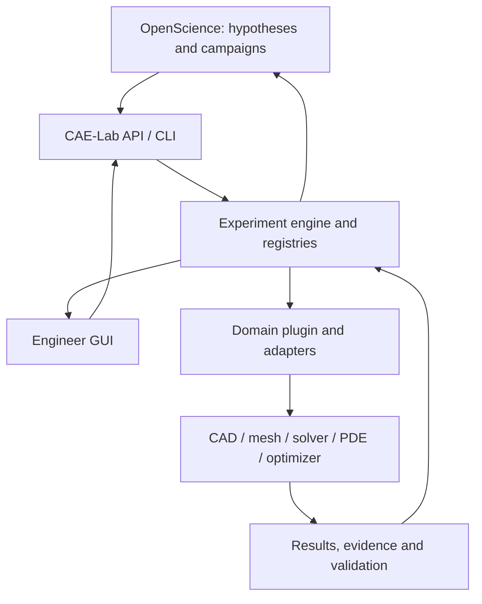

# Architecture

## Control flow

OpenScience selects research questions, variables and campaign strategy and interprets summarized outcomes. CAE-Lab makes immutable experiments, applies gates, invokes typed adapters and returns solver-independent results. A deterministic numerical engine owns parameter generation and search. Domain plugins supply engineering meaning and checks. Adapter internals own Code_Aster commands, OpenRadioss cards, FreeCAD property APIs, UFL forms and optimizer input files. The target GUI and headless flows use the same revision and artifact IDs. The current upstream fixture GUI does not yet navigate CAE-Lab experiment IDs.

## Boundaries and contracts

`schemas/experiment.schema.json` and `schemas/result.schema.json` define versioned JSON envelopes. `caelab.schema` validates them again in Python. Executable Core operations include `create_study`, `discover_parameters`, `register_parameter`, `run_experiment`, `run_analysis`, `inspect_experiment`, `compare`, `plan_doe`, `run_doe` and `inspect_doe`. Standalone generic `mesh`, `pde_solve` and `optimize` operations remain future capabilities. OpenScience uses these operations and never needs native property paths. Unimplemented operations return explicit capability errors.

A registry entry maps `parameter_id` to an adapter-owned native reference (`backend`, `document`, `object`, `path`) with unit, type, bounds, fixed/free, dependency references, source, revision and geometry-effect evidence. Only explicit registration promotes a discovery candidate into a research variable. The adapter verifies that a candidate is writable and influences the final model where the backend permits. Core checks types, bounds and fixed values before CAD work, and validates dependency references at registration. Adapter-owned expressions and model relations are checked during CAD regeneration; Core does not evaluate arbitrary CAD formulas.

`CADAdapter.document_id(model)` supplies the stable native document identity for registry selection. This keeps `.py` source names and FCStd design IDs inside their adapters. Editing that source invalidates mappings until `parameters.refresh` rechecks their effect and writes a new registry revision.

`AnalysisAdapter.solve(parent_result, parent_root, output, settings)` operates on a finished CAD experiment. Core verifies the parent ledger and artifact hashes, then writes a separate child proposal/result/ledger with the same CAD revision. The adapter selects the native exchange artifact and owns meshing, solver deck and result parsing. The first `fixture.calculix` screen is limited to the roller support's validated saddle geometry and illustrative load case. See ADR 0002 and `docs/STRUCTURAL_SCREEN.md`.

`DOEAdapter.sample(registered_variables, count, seed)` owns numerical point generation. `plan_doe` freezes every point and registry/source/adapter identity before execution; `run_doe` reuses the CAD and analysis Core operations with one journal checkpoint per point. The first SciPy Latin hypercube adapter handles continuous variables only, and invalid CAD points have no solver child. Engine choice, rather than solver-specific syntax, is exposed to OpenScience. See ADR 0003 and `docs/DOE_CAMPAIGNS.md`.

Execution order: proposal → parameter checks → CAD regeneration → geometry/domain/manufacturing/interface checks → mesh and solver preflight → simulation → numerical/engineering checks → evidence and decision. A FAIL in a blocking gate suppresses later work. An UNKNOWN blocking release requirement prevents `RELEASED`; it does not fabricate a FAIL or PASS. The Phase 1 CAD-only operation stops before mesh and returns `NOT_RELEASED` even if its CAD checks pass.

Each validation record has `validator`, `type`, `status` (`PASS`, `FAIL`, `UNKNOWN`, `WARNING`), `blocking`, threshold/expected, timestamp, evidence IDs and related revision/run. Evidence is a distinct observation, with metric/value/unit/method/source/artifact linkage. Result metrics contain values and explicit validity or reason; an absent FEA metric is never zero. An artifact record includes relative path, SHA-256, byte size, MIME and revision. The experiment manifest links study/hypothesis → proposal → registry snapshot → CAD revision → artifacts/evidence/validations → decision; future mesh, deck, solver and physical-test nodes extend the same thread.

The experiment store is append-only by experiment ID. Each run writes a new directory, never overwrites a prior result. Artifact paths remain relative to their experiment root; hashes are verified when inspected. A separate same-store ledger checks result/thread hashes for accidental edits; this is not a signed archive against an actor who can edit the entire store. Core and plugin commits, source tree hash, adapter version, Python/runtime, model source hash, input hash, optional solver/material/mesh/seed and execution settings form provenance. Secrets and entire environment dumps are excluded.

## Adapters and plugins

Core has CAD, preprocessor, structural solver, PDE, postprocessor, optimizer and future physical-test protocol slots. `FixtureCadQueryAdapter` delegates to the pinned `auto-fixture-design` implementation. `FixtureFreeCADAdapter` wraps its inspect/register/generate worker and FCStd in an isolated child process; the Core bridge was executed in a [FreeCAD GitHub Actions acceptance](https://github.com/pikachu444/autonomous-cae-lab/actions/runs/36632876593), while the local container still lacks FreeCADCmd. Fixture-specific checks stay in the upstream plugin, not in `caelab`.

Candidates for later stages: Code_Aster with SALOME-MECA GUI for nonlinear implicit, CalculiX/PrePoMax as alternatives, OpenRadioss for explicit, FEniCSx for weak-form research, GetDP/Gmsh for GUI formulation, MOOSE for larger multiphysics, MFront/MTest for constitutive verification, DAKOTA for black-box DOE/UQ, OpenMDAO for MDO, pymoo for multiobjective and PETSc TAO/MOOSE for PDE-constrained work. A candidate becomes an adapter only after an executable benchmark and source-backed capability/license check. See `docs/BACKEND_EVALUATION.md`.

## GUI and physical experiments

The upstream fixture browser remains the first engineer GUI: it edits source or native CAD and downloads editable artifacts. CAE-Lab's experiment path retains the same CAD source/FCStd plus derived STEP/STL/3MF, so a person can open a particular iteration. A later UI queries Core manifests rather than keeping its own result state. Physical measurement, calibration, fabrication and machine-interface evidence use the same evidence/validation records, with `UNKNOWN` until actually measured.

## OpenScience transport

`openscience/contract.md` fixes operation names, JSON input/output and failure semantics. A stdio MCP bridge can be registered as a local connector when OpenScience supports it. The bridge is a thin translator to the Python API/CLI; it holds no solver logic. Shell access, sandbox policy, traces and external model endpoints must be reviewed before any company data crosses this boundary. No live OpenScience call is claimed yet.

## Parallel research

Independent agents may research candidate backends or verify tests. One owner changes each common schema/API/registry at a time; another reviewer checks boundary leakage, benchmark evidence and failure handling. Accepted/rejected decisions and evidence land in an ADR or research note. The root integrator owns cross-domain consistency and end-to-end acceptance.
