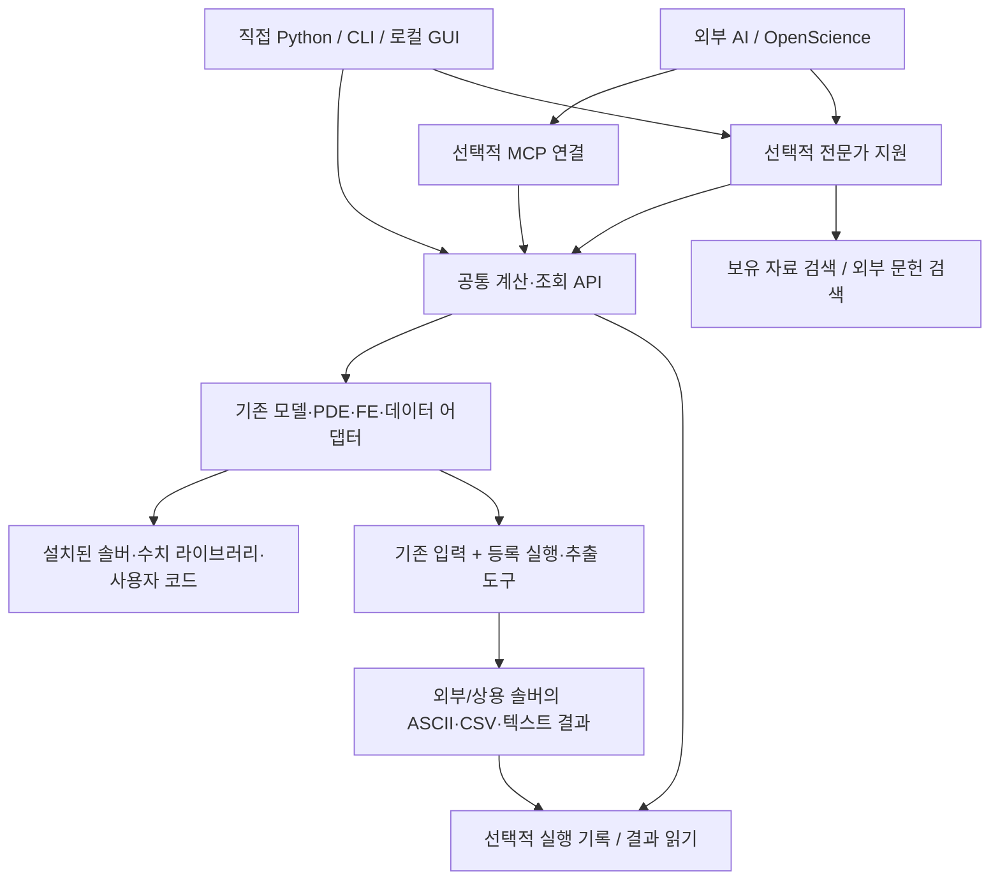
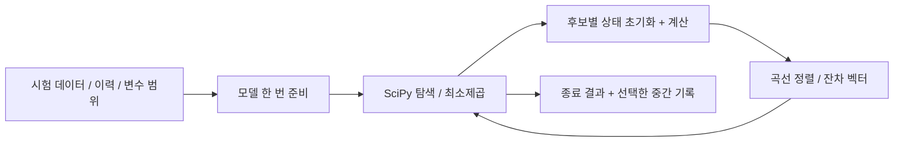
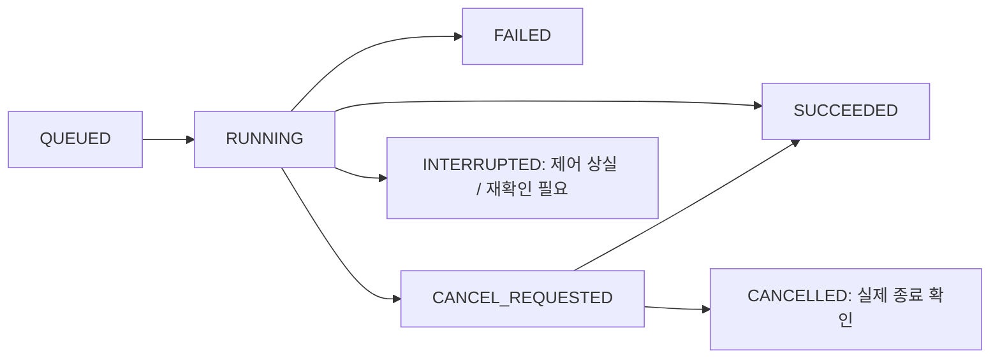
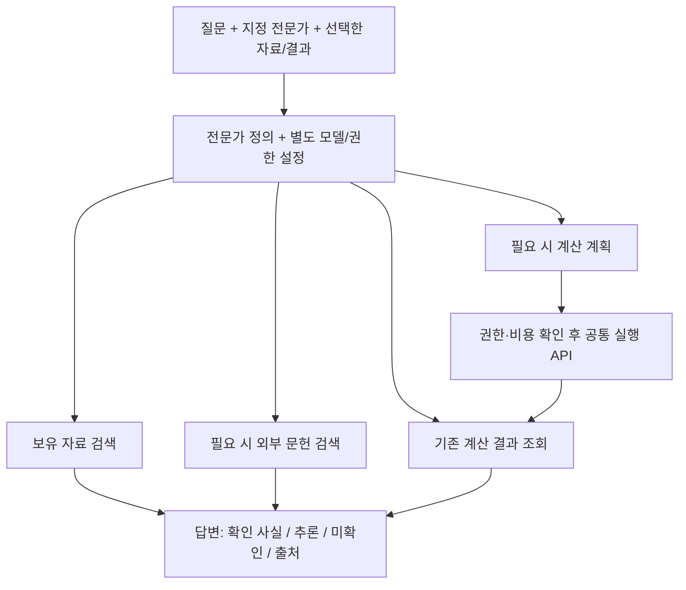
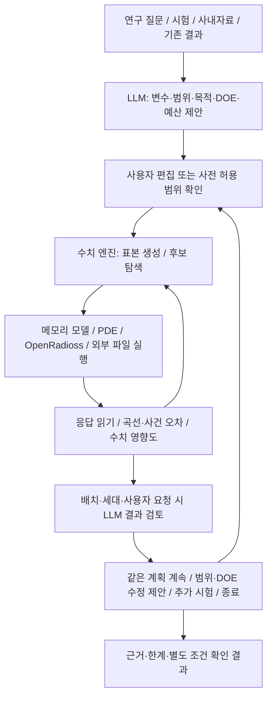
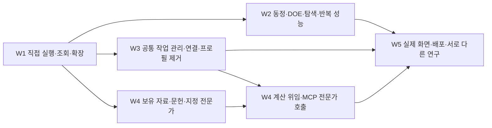

# Autonomous CAE Lab — 통합 설계·구현 명세

**개정 4 · 2026-10-07 · 기존 W1–W5 유지 + 외부 솔버·파일 응답·LLM 연구 반복 연결 / 실행 코드 미구현**

개발 기준 경로: `docs/WORKBENCH_REDESIGN.md`. PDF는 해당 개정의 열람용 출력이다. 기존 PDF/HTML/영상은 개정 3 시점의 설명 자료이며 이번 변경의 실행 증거가 아니다. 이 Markdown이 현재 개발 지시 원본이다. 개정 3은 W2–W5를 한 문단 계획에서 구체적인 기능 묶음으로 확장했다. 개정 4는 그 내용을 유지하면서 외부/상용 솔버의 ASCII 결과와 LLM의 변수·DOE·영향도·후속 탐색을 같은 구조에 연결한다. 예제와 검사 조건은 기능을 확인하기 위한 것이며 제품의 허용 범위를 고정하지 않는다.

검토한 계산 코드: `main@4843c66e482ded31c59604d7cc19d1800be388f4`. 이번 문서 갱신 출발점: PR #1의 `4aabe4feaf5ec932619f8329d6f29598915e5bcd`. 구현 전에 현재 작업 트리와 차이를 확인하되 다시 전체 감사를 시작하지 않는다.

**표기:** ‘현재’는 확인한 기존 코드, ‘목표’는 앞으로 구현할 계약, ‘조건부’는 해당 환경에서 확인 후 선택할 항목이다. 아래 새 API·폴더·검사 이름은 구현 대상이며 지금 사용 가능한 기능으로 읽으면 안 된다. 이 문서는 모든 솔버의 세부 수식을 확정한 문서가 아니라, 제품 전체의 연결 규약과 W1–W5의 기능·변경 범위·완료 조건을 정한 명세다. 상세 명세는 12절, 국소 작업에 머무르지 않는 진행 규칙은 13절이다.

## 1. 무엇을 만들고 무엇으로 성공을 판단할 것인가

회사 연구자가 자신의 코드·시험 데이터·해석 모델·문헌을 가져와 직접 계산하고 비교하며, 필요할 때 전문가 AI를 호출하는 **독립형 연구 작업대**를 만든다. 관리 시스템, 새 최적화 엔진, 새로운 에이전트 운영체제를 만들지 않는다. OpenScience·MCP·CAD·Study 등록 중 어느 것도 모든 작업의 필수 선행 조건이 아니다.

| 사용자 요구 | 설계에서 보장할 경로 | 확인할 실제 행동 |
|---|---|---|
| 형상 없는 재료 평가·동정·구성모델 연구 | 메모리 평가 + 기존 재료 라이브러리 연결 | 이력과 계수를 바꿔 응력·상태·접선·에너지를 비교한다 |
| PDE·수치 알고리즘 연구 | 기존 PDE/모델 어댑터, 원래 설정을 유지 | CAD 없이 실행하고 해·잔차·정확도·시간을 비교한다 |
| 구조·접촉·큰 변형·implicit/explicit·손상 | 기존 솔버 입력과 지원 어댑터 | 기존 모델을 실행한다. 미지원 물리는 지원으로 표시하지 않는다 |
| 실험·기존 결과 분석 | 결과/데이터 읽기 API | 솔버를 설치하거나 다시 실행하지 않고 곡선을 비교한다 |
| DOE·최적화·역문제·UQ·민감도·대리모델 | 평가 함수와 수치 라이브러리의 연결 | 설계치수 외에 재료·하중·수치계수를 탐색한다 |
| 외부/상용 솔버와 별도 ASCII 출력 | 기존 입력·실행·추출 경계, 독립 결과 읽기 | LS-OPT 없이 파일 응답을 같은 DOE·최적화에 사용한다 |
| RAG·논문 검색·지정 전문가·필요 시 협업 | 선택적 전문가 실행과 공통 도구 | 지정한 전문가가 실제 자료를 읽고 출처 있는 답을 준다 |
| LLM이 돕는 반복 연구 | 변수·계획 제안 → 수치 실행 → 영향도 해석 → 후속 계획 | 정해진 optimizer 실행 버튼에만 AI를 붙이지 않는다 |
| 직접 사용·다른 AI 호스트 | Python/CLI, 선택적 GUI/MCP/OpenScience | OpenScience와 MCP를 제거해도 계산·조회는 동작한다 |
| 가벼움·확장성·회사 사용 | 선택 설치, 지연 로딩, 로컬 파일 우선 | 새 기능 때문에 모든 솔버 설치·프로필 복사를 요구하지 않는다 |

다중물리·HPC·시험장비 연계는 이 범위의 확장 대상이다. 첫 구현에서 모두 지원한다고 주장하지 않는다. 위 범위를 지운 채 재료 예제 하나나 CAD 예제 하나를 ‘전체 제품 완료’로 처리하지 않는다.

**추가 확정 요구:** LS-OPT는 사용할 수 없다고 가정한다. 설치·라이선스·실행·결과 형식의 선행 조건이나 대체 실행 경로로 넣지 않는다. 기존 SciPy 등 수치 라이브러리와 우리 입력/결과 연결을 사용한다. OpenRadioss는 기본 연결 대상이지 유일한 계산 도구가 아니다. LS-DYNA 등 외부 솔버를 사용할 때 OpenRadioss 덱으로 변환할 필요는 없다. 칩 충격시험은 사용 사례이며 플랫폼·변수 목록·파일 형식·목적함수를 그 사례에 고정하지 않는다.

## 2. 전체 구성과 의존 방향

### 그림 1. 제품 구성 — 화살표는 호출 방향



**핵심 결정:** 계산 코어는 `openscience`, `mcp`, 채팅 모델, 웹 UI를 import하지 않는다. 조회기는 솔버 설치를 확인하지 않는다. 각 상자는 개별 서버나 패키지가 아니라 책임 구분이다. 처음에는 기존 Python 패키지와 로컬 작업 폴더를 사용한다.

| 책임 | 소유 위치 | 맡지 않을 일 |
|---|---|---|
| 물리모델·솔버 입력·응답 의미 | 기존 `caelab/adapters/`와 도메인 코드 | LLM 인증, 전문가 권한, 웹 요청 처리 |
| 직접 평가와 실행 연결 | `caelab/evaluation.py` 목표 추가 | 새로운 수치 알고리즘, 모든 물리를 담는 만능 스키마 |
| 기록 있는 연구 작업 | 기존 `caelab/engine.py`, 저장·캠페인 코드 | 외부 AI 없이는 실행 불가라는 정책 |
| 결과 읽기·선택·비교 | 기존 결과 관련 모듈 + 얇은 공개 진입점 | 조회 때문에 솔버를 다시 시작하는 일 |
| 외부 입력 변경·실행·파일 읽기 | 기존 어댑터·실행 제어·reader의 조합 | LS-OPT 의존, 새 solver/optimizer, 모든 파일을 읽는 만능 parser |
| 전문가·자료 검색 | 선택적 `caelab/assist/` | 수치 반복마다 모델 호출, 독자적인 에이전트 OS |
| 사용자 진입점 | 기존 CLI·`apps/lab/`·MCP | 프로필별 공학 예외를 각각 구현하는 일 |

## 3. 기존 저장소와 목표 모듈의 대응

현재 `ModelAnalysisAdapter.solve(output, settings)`와 `PDEAdapter`, `ParameterizedModelAdapter`가 이미 있다. 이를 버리고 동일한 역할의 새 Evaluator 엔진을 만들지 않는다. 기존 `Lab`의 기록 있는 실행과 새 직접 사용 진입점이 **같은 어댑터 실행 본체**를 호출하도록 나눈다. [S1–S3]

```text
caelab/
  __init__.py              [수정] 가벼운 공개 진입점, 선택 모듈은 필요 시 로딩
  contracts.py             [확장] 기존 계약 유지·정리, 빠른 평가 계약만 추가
  backends.py              [추가] 어댑터 목록·factory·지연 로딩, 물리 규칙 없음
  evaluation.py            [추가] prepare/evaluate/run, 기존 실행 본체 재사용
  engine.py                [수정] Study/저장 래퍼, 구체 어댑터 생성 목록 분리
  storage.py               [수정] 결과 읽기·저장·큰 파일 처리 책임 정리
  execution_control.py     [재사용] 실제 자식 프로세스·취소 처리
  optimization.py          [수정] 기록과 평가 호출 분리, 기존 계획 데이터 활용
  optimizers/              [재사용] SciPy DE/LHS + 필요 시 최소제곱 연결
  adapters/                [재사용] 모델 준비/계산/파일 출력의 결합만 분리
  assist/                  [후속] experts / knowledge / literature / host 연결
apps/lab/                  [수정] 기존 화면·HTTP, 계산 규칙 복제 금지
openscience/               [축소] 호스트 연결과 MCP transport
scripts/                   [축소] 설치·실행·검증 진입용, 물리 정책은 넣지 않음
```

이는 필수 파일 수를 늘리라는 지시가 아니다. 같은 책임을 기존 모듈에서 간단히 분리할 수 있으면 그 파일을 사용하고 이 표를 갱신한다. **1차 구현에서 `assist/`, 새 스케줄러, 새 데이터베이스를 미리 만들지 않는다.** 기존 `registry.py`는 연구변수 등록이므로 어댑터 등록과 같은 뜻으로 쓰지 않는다.

### 어댑터 등록 규약

`backends.py`는 `id`, `roles`, `factory`, `optional_dependency`를 보관한다. 목록 조회는 모듈을 import하지 않고 설명만 반환한다. 실제 선택 시 factory를 호출하며 누락된 의존성은 그 어댑터만 사용할 수 없다고 반환한다. 외부 확장은 Python의 표준 entry point 그룹 `caelab.backends`로 등록한다. 코어에 업체별 import를 추가하지 않는다. [E1]

`roles`는 예를 들어 `model`, `pde`, `cad`, `analysis`, `reader`, `prepared`의 지원 기능을 나타낸다. 이것은 권한도, 수치 검증 판정도 아니다. 순수 Python 사용자는 신뢰한 어댑터 객체를 직접 전달할 수 있다. MCP/HTTP에서는 클라이언트가 임의 모듈 경로나 코드를 전달할 수 없고 서버에 등록된 ID만 선택한다.

## 4. 계산 API와 입출력 계약

### 4.1 목표 공개 API

아래는 **구현할 함수 규약**이다. 현재 존재한다고 주장하는 예제가 아니다.

```python
prepare(backend, settings, *, runtime=None) -> PreparedEvaluation

evaluate(backend, settings, *, values=None, runtime=None) -> Evaluation

run(backend, settings, *, output, runtime=None, parent=None) -> dict

read_result(path, *, verify="selected") -> dict

list_backends(*, probe=False) -> list[dict]
```

| 함수 | 동작 | 저장·실행 조건 |
|---|---|---|
| `prepare` | 모델/라이브러리를 한 번 준비하고 반복 평가 객체를 반환 | 빠른 평가를 명시적으로 지원하는 어댑터에만 제공 |
| `evaluate` | 준비 → 1회 평가 → 정리의 편의 함수 | Study·가설·영구 폴더 불필요. 반복 동정에는 쓰지 않음 |
| `run` | 기존 파일 기반 어댑터를 실행 | 호출자가 결과 폴더를 지정. 결과가 임시 폴더 삭제로 사라지지 않음 |
| `read_result` | 저장된 결과와 요청한 응답을 읽음 | 솔버·AI가 없는 환경에서도 동작 |
| `list_backends` | 등록 기능 목록 반환 | 기본은 설치 탐색/실행 없음. `probe=True`일 때 환경 확인 |

현재 `Lab.run_model_analysis(study_id=..., experiment_id=..., backend=..., settings=...)` 등은 기록 있는 경로다. 이를 편의상 유지할 수 있지만 새 API에 가짜 Study나 가설을 자동 생성해서 강제하지 않는다. 공통 검증/정규화와 어댑터 실행 본체를 추출해 두 경로가 공유한다. [S1–S3]

### 4.2 빠른 평가의 계약

```python
class PreparedEvaluation(Protocol):
    def evaluate(self, values: dict[str, float]) -> Evaluation: ...
    def close(self) -> None: ...
```

문맥 관리자 진입/종료를 지원한다. `evaluate_many`와 잔차 Jacobian 제공은 선택 확장이다. 배치 입력의 공통 모양은 `(후보 수, 변수 수)`로 하고 SciPy별 배열 모양 변환은 최적화 연결부 한 곳에서 한다.

**재료 상태 규칙:** 각 후보는 동일한 명시적 초기 상태에서 시작한다. 이력의 시간증분 사이에는 상태가 이어지지만 후보 A의 최종 상태가 후보 B로 넘어가면 안 된다. 준비된 객체의 스레드 공유는 기본 금지하며, 병렬 작업자는 각자의 상태와 모델 핸들을 가진다. 빠른 평가 미지원 어댑터는 명확한 오류를 반환한다. 후보마다 디스크/컨테이너를 생성하는 경로로 조용히 바꾸지 않는다.

**파일 실행과의 구분:** 이 메모리 계약은 모든 평가기의 의무가 아니다. 외부 FE 솔버는 4.4절의 파일 실행을 사용하고 같은 응답으로 반환한다. 외부 FE 후보별 작업 폴더·프로세스는 필요한 비용이다. 빠른 재료점의 ‘루프 안 파일/프로세스 생성 0회’를 그 경로에 강요하지 않는다.

### 4.3 입력과 결과의 최소 공통 부분

| 객체 | 필수 내용 | 어댑터에 남기는 내용 |
|---|---|---|
| 실행 입력 | backend, settings, 선택적 변수 값, 실제 runtime 설정 | 원래 솔버 설정, 재료 이력, 경계조건, 초기 상태 |
| 변수 | 이름, 값, 단위, 선택적 범위·변환 | 해당 값이 native 입력의 어느 위치를 바꾸는지 |
| `Evaluation` | execution_status, responses, checks, diagnostics | native 응답과 세부 오류 |
| 응답 한 개 | 종류·값/배열/파일 참조, 단위, 성분, 선택 영역, 집계 방식 | 솔버별 응력·반력·상태변수의 정확한 정의 |
| 곡선·장 | 축 이름·단위·배열 모양 또는 파일/배열 키 | 메시/적분점·절점·좌표계 매핑 |

`responses`의 작은 배열은 메모리에 둔다. 저장할 때 JSON은 설명과 참조만 담고 배열은 기존 적합한 형식으로 저장한다. 큰 장 전체를 MCP 답변에 넣지 않는다. `raw` 결과는 선택적으로 보존해 전문 사용자가 원래 형식으로 내려갈 수 있게 한다.

```json
{
  "execution_status": "SUCCEEDED",
  "responses": {
    "stress_xx": {
      "kind": "series", "unit": "MPa", "component": "xx",
      "location": "material_point", "reduction": "none",
      "axes": [{"name": "time", "unit": "s", "key": "time"}],
      "data_ref": {"file": "arrays.npz", "key": "stress_xx"}
    }
  },
  "checks": [{"name": "physical_calibration", "status": "NOT_ASSESSED"}]
}
```

이 JSON은 **목표 출력의 예시**이며 수치 결과를 제시한 것이 아니다. 실행 성공, 수치 오차, 실제 물성 확인을 한 `PASS`로 합치지 않는다. 기존 결과 스키마에 해당 필드가 있으면 그 필드를 재사용하고 중복 형식을 만들지 않는다. 단위/성분/좌표계 불일치는 기본 비교 오류다. 변환·보간·시간 정렬은 선택한 방법을 기록하며 기본 외삽은 하지 않는다.

### 4.4 외부/상용 솔버와 파일 기반 평가 — LS-OPT 불필요

**책임을 나눈다:** 입력에 계수를 반영하는 부분, 실제 작업을 실행하는 부분, 출력파일을 읽는 부분, 응답에서 오차를 계산하는 부분은 교체 가능해야 한다. 역할을 분리한다는 이유로 별도 서버 네 개를 만들지 않는다. 기존 어댑터·reader·실행 제어에 작은 함수/설정으로 연결한다.

| 사용 경로 | 받을 것 | 할 수 있는 일 | 없는 것을 가장하지 않을 것 |
|---|---|---|---|
| 결과만 가져오기 | ASCII/CSV/텍스트 + 열·단위·조건, 있으면 후보 계수표 | 비교·통계·근거 있는 영향도 분석, 후속 계산 제안 | 계수표가 없는데 변수 영향도를 계산하거나 원래 솔버가 실행됐다고 주장 |
| 파일로 배치 교환 | 후보 ID·계수·시험조건·입력 묶음 → 외부 실행 → 대응 결과 묶음 | DOE 설계와 결과 회수, 다음 계산 배치 선정 | 사람이 수행한 외부 실행을 자동 실행이라고 표시 |
| 등록된 외부 실행 | 기존 덱/include·입력 수정 연결·실행 명령/기존 제출 도구·결과 reader | 후보 평가→오차→다음 후보의 자동 반복 | 솔버 SDK·LS-OPT·OpenRadioss 변환을 선행 조건으로 요구 |

출력파일만으로 과거 결과를 분석하는 경로와, 새 후보를 계산하는 경로는 다르다. **새 후보의 실제 계산 결과가 없으면 미평가 상태로 남긴다.** 대리모델의 예측으로 순위를 제안할 수 있지만 실제 솔버 응답으로 기록하지 않는다. 파일 배치 교환은 기존 DOE/후보 표의 내보내기·가져오기부터 구현한다. 모든 optimizer가 외부 ask/tell 또는 정확 재개를 지원한다고 가정하지 않는다. 지원하지 않는 최적화 방식은 자동 실행 경로에 연결하거나 명시적인 새 탐색/warm start로 진행한다.

#### 공통 연결에 필요한 데이터

| 항목 | 필요한 의미 |
|---|---|
| 후보와 시험 | `candidate_id`, 변수 이름·값·단위, `case_id`, 고정 조건, 계획 구분. 여러 시험은 같은 후보의 별도 case로 묶음 |
| 입력 변경 | 원본 파일/버전, 변수→템플릿·include 항목·등록 함수의 연결, 바뀐 값. 덱 전체를 매번 LLM이 다시 쓰지 않음 |
| 실행 | 등록 명령/제출 도구, 작업 폴더, 자원·시간 예산, 입력과 결과 위치, 종료·중단 확인 방법 |
| 결과 읽기 | 파일 패턴, reader 또는 사용자 추출 도구, 형식/버전, 열·블록·entity 선택, 축·단위·성분·위치·부호 |
| 응답·이벤트 | 기존 `responses`와 곡선/스칼라/사건 규약, 사건의 검출 방법과 관측 구간 |
| 비교 | 대상 시험/기준, 정렬·필터·평가 구간, 잔차·특징값·제약·가중치, 미완료/누락 처리 |

이 항목은 새 거대 스키마의 필수 입력 화면이 아니다. 원문 파일에 있는 정보는 재사용한다. 없는 물리적 의미만 사용자에게 확인하고 설정으로 남긴다. 모호한 숫자 열을 모델이 임의로 ‘로드셀 하중’이나 MPa로 확정하지 않는다.

**ASCII 읽기 기본안:** 단순 구분자/공백 표는 NumPy 또는 pandas, 고정 폭은 pandas 등 기존 reader를 사용한다. [E9–E11] 헤더가 반복되는 native 출력, 시간 블록, 여러 entity, Fortran 지수 표기 등은 실제 파일 표본을 보고 해당 부분만 연결한다. 확장자 `.txt`만으로 모두 같은 형식이라고 가정하지 않는다. 사용자가 이미 만든 추출 스크립트가 있다면 그대로 등록해 표준적인 표로 받은 뒤 읽을 수 있다. native 바이너리를 반드시 직접 파싱하는 기능부터 만들지 않는다. 형식 추정과 변환 코드를 LLM이 도울 수 있지만, 확인된 추출은 재사용 가능한 코드/설정으로 실행한다. **후보마다 수치 파일 전체를 LLM에 보내 읽히지 않는다.**

예를 들어 아래 파일은 특정 솔버의 원래 포맷이 아니라 사용자가 내보낸 표의 예시다. 숫자·열 이름은 제품 규칙이 아니다.

```text
candidate_id,case_id,time_ms,support_force_N
c01,impact_low,0.00,0.0
c01,impact_low,0.02,14.2
```

`time_ms`를 초로 변환하는지, `support_force_N`이 어느 부위·방향·집계의 힘인지 설정에 남긴다. LS-DYNA의 접촉력·지지 반력·단면력 출력은 같은 응답이 아니다. 실제 계측 채널에 맞는 선택을 해야 한다. [E12] 파손/분리/온도 초과와 같은 사건은 추가 출력 또는 명시한 검출 함수에서 얻는다. 없는 손상 정보를 하중 감소만으로 확정하지 않는다.

**결과 연결과 상태:** 파일 이름 정렬이나 도착 순서가 아니라 후보·시험의 명시적 대응으로 읽는다. 자동 실행은 해당 실행의 종료/결과 상태와 필요한 채널·시간 범위를 함께 확인한다. 파일 배치 교환은 사용자가 제공한 실행 정보와 읽기 확인 상태를 구분한다. 빈 파일·아직 쓰는 파일·이전 실행의 잔여 파일·누락 열은 좋은 목적값 0으로 바꾸지 않는다. 재시작에 따른 중복 시각·구간은 처리 방식을 명시한다. 원본은 남기고 선택 구간을 읽으며, 큰 파일 전체를 반복 복사하지 않는다.

**단순 조회는 독립적이다:** 파일을 읽는 데 LS-DYNA 실행파일·라이선스·SDK·AI가 필요하지 않아야 한다. 실제 솔버를 새로 실행할 때만 그 실행 환경과 사용 권한이 필요하다. solver 이름을 Core의 허용 목록이나 별도 ResearchProfile로 고정하지 않는다. 원격 요청은 등록된 실행 도구와 허용 경로를 사용한다. 문서·파일 안의 텍스트를 명령으로 실행하지 않는다.

## 5. 대표 실행 흐름 — 같은 설계가 다른 연구를 받는가

### 그림 2. 직접 실행과 기록 있는 실행


**흐름 A — 재료 동정:** 여러 시험을 읽고 단위·성분을 맞춘다. 모델을 한 번 준비한다. SciPy에 잔차 함수를 넘긴다. 후보마다 상태를 초기화하고 모든 선택 이력을 계산한다. 최적 계수와 곡선별 잔차를 저장하고 동정에 쓰지 않은 데이터로 비교한다. CAD·OpenScience·MCP를 호출하지 않는다.

### 그림 3. 빠른 수치 루프와 기록의 분리



기본 잔차의 구체적 규약은 다음과 같다. 시험 k의 유효 점 수가 `n_k`, 가중치가 `w_k`, 명시한 응답 스케일이 `s_k > 0`일 때:

```text
r[k,i] = sqrt(w_k / n_k) * (prediction[k,i] - observation[k,i]) / s_k
residual_vector = concatenate(r[k,:] for every fitted test k)
```

결측 마스크와 정렬 축은 탐색 전에 확정한다. 후보마다 잔차 길이를 바꾸지 않는다. 스케일·가중치는 사용자 설정/데이터 준비 단계에서 정하며 단위 혼합을 숨기지 않는다. 최소제곱은 SciPy `least_squares`에 벡터를 전달한다. DE는 목적함수와 제약을 기존 방식으로 연결한다. 실패를 좋은 목적값 0으로 바꾸지 않는다. 최소제곱에서 계산 불가 후보가 나오면 명시적 실패 정책을 적용하며 NaN을 그대로 넘기지 않는다. [E2, E3]

**흐름 B — 기존 PDE/FE 실행:** 지원되는 기존 입력/설정과 실행 경로를 지정 → 해당 어댑터만 환경 확인 → 전용 결과 폴더에서 실행 → 원래 결과와 공통 응답 생성 → 솔버가 없는 환경에서 결과 재열람. 임의 입력덱을 모두 지원한다고 주장하지 않는다. 기존 어댑터가 못 받는 입력은 정확한 한계와 추가 연결 부분을 표시한다.

**흐름 C — 결과만 비교:** 기존 두 결과 또는 시험 CSV → 성분·위치·단위·시간 정렬 → 차이·잔차·그래프 → 선택적으로 저장. 새 해석, 모델 등록, 모든 솔버 검사, AI 인증은 0회다.

**흐름 D — 외부 솔버의 파일 응답으로 반복 연구:** 기존 덱/계수표/결과 파일을 가져온다. 4.4절의 채널 매핑과 7.1절의 연구 계획을 정한다. 기존 수치 라이브러리가 후보를 만들고 외부 실행 또는 파일 배치 교환으로 응답을 얻는다. 같은 비교 코드가 오차와 영향도 자료를 계산한다. LLM은 계산된 근거를 읽고 다음 계획을 제안한다. LLM 없이 사용자가 동일 계획을 편집·실행할 수도 있다.

## 6. 성능·저장·실행 관리의 구체적 결정

| 구간 | 구현 결정 | 검증할 비용/행동 |
|---|---|---|
| 빠른 반복 | 준비 객체 재사용, 후보별 상태 분리 | 루프 내 LLM 0회, 지원된 메모리 경로의 subprocess/영구 폴더 생성 0회 |
| 최적화 연결 | 현재 SciPy 재사용; serial/batch/process를 명시 선택 | 같은 입력·같은 정확도로 처리량, 시작 비용, 최대 메모리 비교 |
| 캐시 | 준비 객체/한 연구 안에서만 시작 | 고정 설정·이력·초기 상태·모델이 바뀌면 무효. 계수만으로 전역 재사용 금지 |
| 긴 계산 | 기존 프로세스 실행·취소 코드 재사용 | 각 작업 폴더 분리. 계산 전체를 전역 파일 잠금으로 직렬화하지 않음 |
| 외부 FE 반복 | 후보·시험별 필요한 파일과 실행 보존, 추출 결과 재사용 | 솔버 시간과 준비·대기·추출 시간을 분리. 수치 루프 내 LLM 해석 호출 없음 |
| 병렬 | 작은 로컬 실행기 우선, CPU·메모리 수요 명시 | 작업 수 × 솔버 스레드 수, 데이터 복제량, 실패 격리 확인 |
| 기록 | 단일 실행/전체 탐색 단위로 입력·결과와 선택한 중간 상태 저장 | 수만 후보에 자동으로 수만 실험 폴더를 만들지 않음 |
| 결과 조회 | 요약 우선, 큰 파일은 필요한 부분만 읽음 | read_bytes 전량 복사를 줄이고 재계산을 유발하지 않음 |

현재 DE의 `workers=1`, `vectorized=False`는 실제 코드에 고정돼 있다. 변경은 숫자만 바꾸는 것이 아니다. 로컬 중첩 함수의 프로세스 직렬화, 작업자별 모델 준비, 목적/제약 중복평가, 파일 충돌을 함께 해결한다. SciPy DE에서 병렬/벡터화는 `deferred` 갱신과 연결되며 별개의 실행 방식이다. [S4, E3]

최소제곱의 `workers`는 수치미분 평가의 병렬화 옵션이다. 이를 일반 FE 캠페인 스케줄러로 오해하지 않는다. 서로 다른 설정·병렬 알고리즘에서 후보 순서가 무조건 과거와 같아야 한다는 검사도 만들지 않는다. 최종 응답의 타당성과 선언한 실행 방식의 재현성을 구분한다. [E2]

외부 솔버는 사용자 설정의 동시 실행 수·CPU·메모리·사용 가능한 라이선스 실행 수를 고려한다. 독자 라이선스 관리자를 만들거나 실제 보유량을 추정해 병렬 작업을 늘리지 않는다. 비싼 FE 평가에 큰 기본 DE 집단을 무조건 적용하지 않는다. 기존 DOE로 영향도를 먼저 보고 계산 예산에 맞는 탐색/대리모델을 선택한다. 이런 판단은 특정 solver 이름이 아니라 실제 비용과 응답 특성에 따른다.

### 그림 4. 작업 상태 — 요청과 실제 종료를 구분



늦은 취소 요청 전에 이미 완료됐다면 완료로 남긴다. 프로세스가 사라졌는지 확인되지 않으면 CANCELLED라고 쓰지 않는다. 기존 복구 제어가 더 정확한 상태를 갖고 있다면 UI 표현과 매핑하며 또 다른 상태기계를 복제하지 않는다.

**관리 책임:** W1의 직접 사용은 동기 실행이다. 후속 병렬/채팅 작업은 기존 `LabService`의 작업 관리 책임을 UI 바깥으로 분리하여 하나만 사용한다. HTTP와 MCP가 별도 관리자로 같은 작업을 중복 실행하지 않게 한다. 초기에는 한 작업공간의 관리 실행은 한 제어 프로세스가 맡는다. 그 안의 독립 평가 병렬화는 허용한다. 일반 Python 실행은 각자의 결과 경로를 사용한다. 분산 복구·HPC 스케줄러는 이번에 만들지 않는다.

**출처 기록:** 실제 사용한 입력·모델/솔버 버전·계수·이력·난수 설정·중단 이유를 저장한다. 파일 지문은 입력 식별과 중요한 결과 손상 확인에 쓴다. 새 프롬프트나 프로필을 추가할 때 과거 문자열 지문 보존을 요구하지 않는다. 오래된 원본을 읽는 기능과 동일 환경에서 다시 계산하는 기능을 분리한다.

## 7. 전문가·RAG·문헌의 실행 계약

### 그림 5. 지정 전문가의 질문 처리



전문가 정의 예시는 아래처럼 **역할·지식·도구의 조합**이다. 허용 도구 수, 특정 물리 예제, 모델 이름, 과거 해시를 묶은 ResearchProfile로 만들지 않는다.

```yaml
id: materials
label: 재료 연구 전문가
instructions: 재료모델과 시험자료를 검토하고 적용 가정과 근거를 구분한다.
collections: [materials, project-current]
tools:
  - knowledge.search
  - literature.search
  - literature.read
  - results.read
  - calculations.plan
answer_sections: [conclusion, evidence, assumptions, next_check]
```

모델·인증·자료 외부 전송·계산 실행 권한은 별도 실행 설정이다. YAML은 시스템이 신뢰해 읽는 로컬 설정이며 문서 검색 결과가 이 설정을 변경하지 못한다. `@전문가`는 UI가 식별자로 전달하고 사용자가 선택한 전문가를 조용히 바꾸지 않는다.

| 함수의 목표 계약 | 반환 내용/처리 |
|---|---|
| `knowledge.search(query, collections, filters, top_k)` | 문서 ID·버전·페이지/절·본문 구간·검색 점수. 현재 프로젝트 접근 범위 적용 |
| `literature.search(query, providers, filters)` | DOI/제목/저자/연도/원문 후보/어느 provider에서 찾았는지 |
| `literature.read(paper_id, locator)` | 실제 확보한 구간과 접근 상태. 초록/원문/표·그림 확인 구분 |
| `experts.ask(expert_id, question, context, session_id=None)` | 답변·주장별 출처·가정·도구 사용 요약·추가 질문/계산 계획 |
| `calculations.plan(request)` | 실제 지원 backend와 입력·자원·예상 실행 내용. 이 단계에서는 실행 안 함 |

답변의 인용은 `document_id + revision + locator` 또는 `run_id + response selection`에 연결한다. 외부 논문은 DOI가 없으면 provider ID/URL로 구분한다. 새 자료는 임시 자료로 읽을 수 있고, 지식 모음 편입은 별도 사용자 의도로 수행한다. AI 요약을 자동으로 원문 사실로 승격하지 않는다.

**RAG 구현 기본안:** 검색/랭킹을 직접 만들지 않는다. 작은 표본에서는 Haystack의 기존 문서·BM25 구성요소를 사용하고, 임베딩·재정렬은 같은 표본의 근거 검색 품질이 필요로 할 때 추가한다. 첫 버전은 원문과 구간 정보를 로컬에 남기고 인덱스를 재생성 가능하게 한다. 인메모리 검색이 큰 회사 자료까지 충분하다고 가정하지 않는다. 그 한계가 측정되면 저장소만 교체한다. [E4]

**전문가 실행 기본안:** 기존 OpenScience 호스트에서 먼저 공통 도구를 사용하게 한다. OpenScience 없는 내장 AI 실행이 필요한 후속 묶음에서는 기존 Haystack Agent를 우선 연결 시험한다. 도구 호출 루프를 독자 구현하지 않는다. 선택한 로컬/회사 승인 모델의 도구 호출·출처·중단 시험이 통과해야 채택한다. 이 선택은 계산 코어에 영향을 주지 않는다. 두 호스트를 동시에 필수 설치하지 않는다. [E5]

외부 문헌은 현재 호스트의 검색 도구가 충분하면 그것을 재사용한다. 부족한 provider만 얇게 연결한다. arXiv·OpenAlex·Crossref·PubMed/PMC를 모두 처음부터 자체 수집기로 구축하지 않는다. 회사 자료의 외부 검색어/모델 전송은 명시한 정책 범위에서만 허용한다.

### 7.1 LLM의 연구 설계와 수치 엔진의 반복 계산

**목표는 optimizer 호출에 설명을 붙이는 수준이 아니다.** LLM은 사용자 질문·현재 모델·자료를 보고 변수와 DOE를 제안한다. 계산된 영향도와 오차를 읽고 다음 연구 방향을 제안한다. 실제 표본 생성·수치 평가·최적화·영향도 계산은 기존 라이브러리와 도구가 맡는다. LLM 없는 직접 연구 경로도 같은 기능을 사용한다.



| 단계 | LLM이 할 일 | 계산 도구가 할 일과 반환 |
|---|---|---|
| 변수 선택 | 재료·하중·접촉·경계·치수·수치계수 중 후보와 근거 제시, 고정/자유와 혼동 요인 설명 | 실제 변경 가능한 입력 위치·단위·범위·형식 확인 |
| DOE 설계 | 선별/응답면/전역 영향도 목적에 맞는 방법·계산 수·반복·확인 조건 제안 | 선택된 기존 sampler로 후보 생성, 방법·seed·평가 수 반환 |
| 오차/목표 | 곡선·특징값·파손 등 사건·제약의 의미와 가중치 제안 | 고정된 추출·정렬·평가 규약으로 수치 계산 |
| 영향도 검토 | 어떤 응답·구간에 어떤 변수가 영향을 주는지 계산 근거로 설명 | 표본에 맞는 회귀/민감도·상호작용·불확실성/적용범위 자료 반환 |
| 후속 탐색 | 중요 변수 집중, 범위 조정, 후보 모델 비교, 추가 DOE/시험, 중단 이유 제안 | 승인 범위 안의 다음 배치/탐색을 실행하고 실제 응답 보존 |

`calculations.plan`은 단일 해석뿐 아니라 DOE·동정·최적화·영향도 분석의 계획도 받는다. 기존 계획 데이터에 필요한 필드를 추가한다. 별도 Agent OS나 승인 프레임워크를 만들지 않는다. 계획은 최소한 연구 목적, 입력/결과 참조, 변수와 연결·범위의 근거, 응답 선택, 목적/잔차·제약, DOE/탐색 방법과 옵션, 계산 예산, 검토 시점, 별도 확인 조건을 가진다. 사용자에게 필요한 정보는 편집 가능한 표로 보여주고 모든 내부 ID를 입력시키지 않는다.

예를 들어 사용자가 ‘어떤 계수를 바꿔야 할지 모르겠다’고 하면, 전문가는 입력 덱·계수표·기존 시험과 관련 자료에서 후보를 찾는다. 모르는 물성 범위는 가정으로 표시한다. 초기 DOE가 반환되면 수치 도구의 영향도 표를 읽고 다음 탐색을 좁힐 근거를 설명한다. 영향도 계산에 필요한 계수-응답 대응이나 표본 수가 부족하면 그 부족분과 다음 DOE를 제안한다. **LLM이 숫자로 만든 중요도 점수를 민감도 분석 결과라고 표시하지 않는다.**

추가 도구 의미는 ‘후보 생성’, ‘배치 실행/회수’, ‘응답 비교’, ‘영향도 계산’, ‘계획 수정’이다. 기존 W2/W3 API를 도구로 노출한다. 같은 역할의 새 중복 API나 자연어 전용 계산 경로를 만들지 않는다. 분석 결과에는 사용 후보/응답 ID, 분석 방법, 변수 범위, 누락/실패, 실제 수치와 한계가 포함돼야 한다. SALib처럼 표본 생성과 결과 분석을 나누는 기존 라이브러리를 재사용한다. [E7, E13]

**비교 기준의 변경:** 한 탐색 안에서 LLM이 목적함수·필터·정렬·가중치를 몰래 바꾸지 않는다. 변경할 때는 무엇이 달라졌는지 남기고 해당 후보들의 저장 응답을 같은 기준으로 다시 평가한다. 기준이 다른 목적값을 한 순위에 섞지 않는다. 변수 범위·모델·응답 변경에 따라 캐시와 대리모델의 유효 범위도 확인한다. 영향이 작다는 판단은 사용한 범위·데이터에 조건부이며 영구적인 변수 제외 규칙이 아니다.

**권한과 중단:** 사전 허용된 변수·범위·계산 수·자원·자료 전송 안에서는 매 후보를 재승인받지 않는다. 범위 확대나 새로운 자료 전송은 확인한다. LLM 검토는 배치/세대/오류 발생/사용자 요청 등 정한 시점에 수행하며 후보마다 호출하지 않는다. LLM 또는 네트워크가 끊겨도 이미 승인된 수치 배치와 결과 읽기는 독립적으로 유지한다. 새로운 LLM 판단이 필요한 다음 배치는 대기 상태로 남긴다. 실제 솔버 중단은 W3의 작업 상태를 따른다.

이 연구용 LLM의 역할은 `docs/CODEX_WORKFLOW.md`의 개발 에이전트 분업과 별개다. 개발에 Astra를 쓴다고 제품이 그 모델이나 Codex 계정을 필수로 사용하게 만들지 않는다.

## 8. MCP·OpenScience·직접 사용의 관계

| 사용 방식 | 필요한 것 | 없어도 되는 것 |
|---|---|---|
| Python으로 가상 시험·최적화 | 해당 계산 라이브러리/어댑터 | UI, MCP, OpenScience, LLM |
| 저장 결과 비교 | 결과 읽기 구성요소 | 원래 솔버, AI 인증 |
| 외부 ASCII 결과 분석·다음 DOE | 출력파일·계수/조건 대응·reader, 필요한 수치 라이브러리 | 외부 솔버 설치·LS-OPT·MCP·LLM |
| 외부 솔버 자동 반복 | 등록된 입력/실행/추출 연결과 실제 실행 환경 | LS-OPT·덱 변환·별도 solver SDK가 보편적 선행 조건은 아님 |
| 로컬 GUI 연구 | 같은 API와 UI | 외부 AI, MCP |
| 외부 AI가 도구 사용 | 기존 MCP SDK + 같은 API | 내부 전문가 모델 |
| 외부 AI가 내부 전문가 호출 | MCP + 선택한 전문가 호스트/모델 | OpenScience 자체는 필수 아님 |
| OpenScience 연구 | OpenScience + 같은 도구 | 별도 자체 오케스트레이터 |

MCP의 목표 도구는 `backends_list`, `calculation_run`, `job_status`, `job_cancel`, `result_read`, `knowledge_search`, `literature_search`, `expert_ask`다. 기존 이름을 그대로 쓸 수 있으면 유지하며 명칭 통일만을 위해 복제하지 않는다. 장기 실행은 작업 ID를 반환하고 상태를 조회한다. 원문/큰 결과는 ID와 요청 범위로 읽는다. 7.1절의 계획·DOE·영향도 기능도 같은 공통 API를 노출한다.

권한 확인은 서버 경계의 한 곳에서 수행한다. 허용된 backend 실행, 허용된 파일 루트, 명시적 자원/비용 제한은 유지한다. 특정 ResearchProfile 이름 때문에 공통 API가 가능한 계산을 MCP에서 거부하는 예외는 제거한다. 직접 Python의 신뢰된 사용자 함수가 원격에서도 임의 코드 실행 권한을 뜻하지는 않는다.

OpenScience는 전문가 호스트 중 하나다. 회사 설치판의 라이선스·인증·배포본은 따로 확인하고, 검증한 소스/배포본을 보관한다. ‘오픈소스이므로 모든 외부 인증도 영구 동작’한다고 가정하지 않는다. MCP도 전송 규격일 뿐이며 실제 클라이언트의 연결 방식은 확인해야 한다. [E6]

## 9. 최소 화면 설계

기존 `apps/lab` 화면을 활용한다. 새 디자인 시스템부터 만들지 않는다. 화면 이름은 조정 가능하지만 다음 정보의 위치와 동작은 구현한다.

```text
┌────────────────────────────────────────────────────┐
│ 작업공간 / 선택한 모델·자료        실행 상태         │
├──────────────┬───────────────────────┬──────────────┤
│ 자료·모델    │ 계산 / 비교 / 결과    │ 전문가 대화  │
│ 기존 파일   │ 입력·단위·조건        │ 선택 전문가  │
│ 결과 목록   │ 곡선·장·오차·로그     │ 출처/도구    │
│ 실행 목록   │ [실행] [중단] [저장]  │ 계산 제안    │
└──────────────┴───────────────────────┴──────────────┘
```

전문가 패널은 꺼도 계산·비교가 동작한다. 파일을 가져오면 Study 작성부터 요구하지 않는다. 실행 버튼은 선택 모델에 필요한 준비 상태만 확인한다. 기존 결과를 선택하면 실행이 아니라 읽기가 일어난다. 결과의 기본 표시는 실제 값·단위·조건·한계이며, 긴 ID·파일 지문·세부 로그는 펼쳐서 본다. 전문가의 계산 제안은 실제 실행 상태와 구분한다.

외부 파일에는 원문/열 미리보기와 후보·시험·채널·단위의 대응을 제공한다. 전문가가 제안한 변수·범위·DOE·목적·예산은 같은 편집 화면에 반영한다. 사용자는 제안을 고치고 실행하거나 결과 파일만 가져올 수 있다. 영향도 표의 행을 선택하면 사용한 응답과 원문 결과를 확인한다. 채팅 답변에만 존재하고 실행 화면에는 전달되지 않는 계획으로 끝내지 않는다.

## 10. 무엇을 유지·이동·삭제할 것인가

| 현재 파일/부분 | 구체적 변경 | 함께 없애거나 바꿀 것 |
|---|---|---|
| `caelab/__init__.py` | 기본 import가 모든 어댑터 초기화를 당기지 않도록 수정 | 기본 import에 솔버/AI 설치가 필요하다는 테스트 전제 |
| `caelab/engine.py` 초기화 | 구체 어댑터 생성 목록을 `backends.py` factory로 이동 | 새 backend마다 코어 생성 목록 수정 |
| `caelab/contracts.py` | 기존 파일 실행 계약에 빠른 평가 선택 계약 추가 | CAD를 모든 평가의 필수 부모로 취급하는 새 코드 |
| 기존 모델/PDE 실행 본체 | 입력 검증·어댑터 호출·결과 정규화와 기록 래퍼 분리 | 새 API에서 기존 solve 코드를 복사하는 방식 |
| `caelab/optimizers/scipy_de.py` | 현재 수치 알고리즘/제약 처리 유지, 일반 변수와 평가 호출 분리 | 최적화가 항상 CAD 변수 효과 PASS 기록을 필요로 하는 결합 |
| `caelab/adapters/mfront_inverse.py` | 모델 준비/이력 평가/목적함수/설치 확인 분리 | E-only를 일반 동정의 영구 입력 규칙으로 사용 |
| `caelab/storage.py` | 큰 파일 스트리밍, 선택 조회, 반복 소스 검사 축소 | 조회 때 실행 환경 동일성까지 무조건 강제 |
| 기존 reader·응답 비교·후보 표 | 외부 ASCII·추출 파일을 4.3절 응답에 연결하고 원래 계산/비교를 재사용 | 상용 결과 전용 optimizer나 칩 전용 결과 체계 |
| `apps/lab/service.py`, `openscience/jobs.py` | 작업 관리 책임 하나로 통합, 화면·transport는 위임 | 같은 작업공간에 서로 다른 작업 관리 상태 중복 |
| `openscience/mcp_server.py` | 공통 API 호출, 결과/작업 상태 노출 | `optimization_run`의 특정 프로필 이유 실행 거부 |
| `scripts/openscience-research.ps1`, `openscience/native_guard.mjs` | 일반 권한·runtime 설정만 호스트 연결에 남김 | 시나리오별 고정 tool/mesh/model 정의와 복사 descriptor |
| profile 전용 검증 스크립트/테스트 | 대체 경로가 실제 연결된 묶음에서 제거 | 옛 이름·도구 개수·prompt/descriptor 지문 동일성 요구 |
| `AGENTS.md`, README, 누적 계획 문서 | 이 문서 하나를 현재 구현 기준으로 연결 | 매번 모든 ADR 필독, 같은 상태 여러 문서 복제 |

전체 파일을 이름만 보고 삭제하지 않는다. 같은 파일에 있는 경로 접근 보호나 실제 취소 처리는 재사용한다. 과거 개발 결과의 영구 호환 계층은 만들지 않는다. 사용자 자료와 미커밋 작업은 자동 삭제하지 않는다. 정리가 필요한 과거 기록은 삭제 목록을 한 번 확인하고 처리하며, 이를 매 기능의 새 승인 절차로 만들지 않는다.

## 11. 외부 기술 선택 — 이번에 정한 것과 미룬 것

| 영역 | 기본 결정 | 바꾸는 조건 |
|---|---|---|
| 수치 계산·DE·LHS·최소제곱 | NumPy/SciPy 재사용 | 필요한 알고리즘이 없거나 수치 성능/제약 요구가 맞지 않음 |
| 모델/솔버 | 기존 어댑터·Code_Aster/OpenRadioss/FEniCSx/MFront 등 | 실제 지원 범위/실행 환경 문제에 맞춰 연결 개선 |
| 외부/상용 솔버 | 기존 덱 + 등록 실행/추출 + 공통 응답, LS-OPT는 사용하지 않음 | 해당 solver의 실제 카드/출력·설치에 필요한 연결만 추가 |
| 표 형식 파일 | NumPy/pandas 등 기존 읽기 도구와 사용자 추출 도구 | native 블록 등 실제로 지원되지 않는 부분만 얇게 연결 |
| 플러그인 발견 | 표준 Python entry point | 특수 배포 요구가 확인되기 전 독자 플러그인 OS 금지 |
| 로컬 실행 | 기존 실행 제어 + 표준 실행기 우선 | 실제 다중 기계·장기 복구 요구가 생기면 전문 도구 비교 |
| 검색·내장 전문가 | Haystack 구성요소 우선 연결 시험 | 실제 문서·승인 모델로 품질/비용/호환 문제가 확인됨 |
| MCP | 현재 공식 SDK 사용 | 필요한 transport와 실제 클라이언트로 검증 |
| 개발 도움 | 기존 grill-me·검색 우선·리뷰 도구를 필요 시 사용 | 부족한 행동이 실제로 확인될 때만 최소 맞춤화 |

GEMSEO·OpenMDAO·AiiDA·Parsl·pymoo·SALib 등을 이 표에 전부 필수 의존성으로 추가하지 않는다. 연성·미분·UQ·원격 작업 등 구체 요구가 발생했을 때, 필요한 사용자 코드와 실행 부담을 줄이는지 비교한다. 기존 SciPy 연결을 버리고 새 프레임워크를 쓰는 것 자체는 성과가 아니다.

버전 잠금은 검증 환경을 재현하기 위해 패키지/환경 파일에 남긴다. 특정 개발 컴퓨터의 바이너리 지문을 모든 회사 설치의 허용 조건으로 쓰지 않는다. 문서에 적은 후보가 현재 환경에서 설치·성능 검증됐다는 뜻은 아니다.

## 12. W1–W5 구현 명세 — 모든 단계의 기능과 종료 지점

**이 절은 일정표가 아니라 구현 계약이다.** 각 단계의 결과는 사용자가 할 수 있게 된 연구 작업이다. 테스트·감사·문서 분량은 결과물을 대신하지 못한다. 아래 함수명과 파일 배치는 목표이며, 동일 책임을 가진 기존 API가 있으면 확장하고 중복 API를 만들지 않는다.

### 12.1 전체 의존 관계와 진행 원칙



W2의 모든 성능 개선이 끝나야 W4를 시작하는 순서가 아니다. W1의 입력/결과 경계가 연결되면 W2, W3, W4의 자료 검색을 진행할 수 있다. W4의 실제 계산 위임은 W3 작업 관리에 연결한다. 단일 개발 세션에서는 한 묶음씩 통합하되, 외부 환경 때문에 막힌 항목과 무관한 묶음은 계속 진행한다.

| 단계 | 사용자가 얻는 기능 | 주요 변경 영역 | 이 단계의 제출물 |
|---|---|---|---|
| W1 | AI·CAD 없이 계산하고, 솔버 없이 결과를 읽는다 | 공개 API·선택 설치·어댑터 발견 | 직접 호출 예제, 기존 backend 실행, 결과 재열람 |
| W2 | 여러 계수·시험곡선으로 동정하고 DOE/탐색·통계 분석을 한다 | 최적화·재료 준비·반복 실행·저장 | 동정 결과, 후보/응답 표, 비교곡선, 성능 비교 |
| W3 | GUI·CLI·MCP에서 같은 계산 작업을 실행·중단·조회한다 | 작업 관리·전송·권한·프로필 | 같은 작업 ID를 보는 연결 경로, 제거한 중복 규칙 |
| W4 | 전문가 지정, 보유 자료/논문 조사, 계산 결과 해석·추가 실행 | 자료 검색·전문가 설정·모델 연결 | 출처를 열 수 있는 대화와 실제 도구 호출 |
| W5 | 회사에서 설치 후 자료를 넣고 연구·비교·보고서를 작성한다 | 실제 화면·패키징·업무 연결 | 실행 가능한 사용자 예제·보고서·설치 안내 |

**기능 묶음의 공통 종료 조건:** 필요한 계산/읽기/화면 경로를 연결하고, 그 경로의 오류와 핵심 회귀만 확인한 뒤 다음 묶음으로 간다. 유용한 작은 수정도 해당 묶음의 사용자 산출물과 함께 제출한다. 다음 작업으로 넘어가기 위해 새 프로필·새 승인 문서·과거 문자열 동일성 증명을 만들지 않는다.

**개정 4의 배치:** 파일 응답과 LLM 연구 반복은 새 별도 프로젝트가 아니라 아래 W1–W5에 들어간다. 공통 입력/실행/결과 경계는 1차에 만든다. 개별 상용 솔버의 모든 카드·설치·실제 회사 검증은 후속 어댑터 작업이다. LS-DYNA 또는 회사 자료가 없다는 이유로 공통 기능을 미루지 않는다. 12.8절에서 구현과 후속 연결의 범위를 구분한다.

### 12.2 W1 — 독립 사용과 확장 경계

**완료된 사용자 행동:** Python 함수나 지원 모델을 직접 실행하고, 선택한 경우에만 기록한다. 결과를 읽기 위해 원래 솔버나 AI를 설치하지 않는다.

**변경 위치:** `caelab/__init__.py`, `contracts.py`, `engine.py`, 기존 모델/PDE 실행 본체·CLI·설치 파일. `backends.py`, `evaluation.py`는 분리할 책임이 기존 모듈에 없을 때만 추가한다.

**구현 순서**

1. 현재 브랜치와 미커밋 변경을 확인하고 관련 실행 본체를 읽는다. 기존 수치 구현을 다시 작성하지 않는다.
2. `pyproject.toml`에 실제 Python 의존성을 모으고 선택 기능을 분리한다. 네이티브 솔버는 별도 설치 경로로 취급한다. 기본 import와 목록 조회에서 모든 솔버·AI 모듈을 초기화하지 않는다.
3. 어댑터 factory 지연 로딩과 표준 entry point 연결을 구현한다. 등록 목록, 설치 여부, 실제 실행 지원 여부를 구분한다.
4. 4절의 `prepare/evaluate/run/read_result`를 연결한다. `Lab`의 기록 있는 실행은 같은 실행 본체를 사용한다. 가짜 Study/가설을 만드는 우회로는 만들지 않는다.
5. 신뢰된 사용자 함수와 기존 비-CAD 어댑터를 같은 공개 경로로 사용한다. 외부 함수의 직접 Python 사용이 원격 임의 코드 실행을 뜻하지 않도록 구분한다.
6. Python 예제와 CLI 도움말을 제출하고 아래 사용자 경로를 확인한다.

| 확인할 경로 | 필요한 동작 |
|---|---|
| 선택 기능 없는 기본 설치 | import/목록 조회·저장 결과 읽기에서 CAD·MCP·AI 초기화 없음 |
| 직접 함수 평가 | Study·영구 폴더 없이 배열을 반환하고 원래 함수의 값과 일치 |
| 외부 어댑터 추가 | 등록과 어댑터 코드만으로 연결, 코어·PS·JS 프로필 수정 없음 |
| 기존 backend 실행 | 실제 설치된 재료/PDE/FE 어댑터 하나를 실행하고 결과 재열람 |
| 준비 객체 재사용 | A→B→A 평가에서 상태가 섞이지 않고 A 단독 결과와 일치 |
| 잘못된 입력 | 누락 의존성·단위 오류·미지원 기능을 구분해서 설명 |

**파일 경로의 추가:** 4.4절의 ASCII/CSV 읽기를 기존 결과 API에 연결한다. 외부 실행은 입력 변경→등록 명령→추출 파일의 얇은 연결로 같은 응답을 반환하게 한다. 사용 가능한 작은 외부 프로그램으로 연결을 확인하되 이를 LS-DYNA 실행 검증이라고 하지 않는다. 결과만 가져올 때는 실행 부분 없이 같은 reader를 사용한다.

**완료가 아닌 것:** 빈 클래스, import만 되는 패키지, 시험용 함수만으로 모든 native 경로가 된다는 주장. native 환경이 없으면 그 연결의 실제 실행만 미확인으로 남기고 나머지 작업을 진행한다.

**다음 연결:** W2는 준비된 계산 객체와 응답 또는 파일 실행 응답을, W3는 직접 실행/조회 함수를, W4는 결과 읽기와 자료 ID를 사용한다.

### 12.3 W2 — 실제 동정·탐색 기능과 수치 반복의 경량화

**완료된 사용자 행동:** 여러 시험곡선과 여러 계수로 모델을 동정하고, 변수 범위나 입력 분포를 바꿔 반복 계산한다. 결과는 후보 표·응답·오차·그래프로 보고, 무거운 실행 관리 없이 같은 계산 함수를 재사용한다. ‘파일 I/O를 측정했다’만으로 끝내지 않는다.

**변경 위치:** `caelab/optimization.py`, `optimizers/scipy_de.py`, 기존 DOE·`model_doe.py`·`campaign_report.py`·`multiobjective.py`, `adapters/mfront_inverse.py` 및 실제 재료 준비 코드, `storage.py`. 파일 존재와 사용 경로는 구현 시작 시 확인한다. 새 최적화 엔진이나 별도 연구 등록 체계는 만들지 않는다.

#### W2-A. 시험 입력·다중 곡선·계수 동정

| 계약 | 구현 내용 |
|---|---|
| 시험 입력 | CSV/NPZ/메모리 배열. 각 시험의 축·응답 열·단위·성분·하중 이력·초기 상태·온도(필요 시)를 명시 |
| 모델 입력 | backend 또는 신뢰된 준비 함수/파일 평가 연결, 고정 settings, 변수 목록. 계수 이름·단위·초깃값·범위·선택적 log 변환 |
| 학습/확인 분리 | 시험 또는 이력 단위로 fit/holdout 지정. 한 곡선의 이웃 점을 나눠 독립 실험 검증처럼 표시하지 않음 |
| 정렬 | 관측 축으로 예측값을 정렬. 선형 보간을 기본안으로 하되 응답 특성상 부적절하면 명시 변경. 외삽은 기본 오류 |
| 잔차 | 5절의 고정 길이 잔차 벡터. 시험별 가중치/스케일·결측 마스크를 탐색 전에 확정 |
| 최적화 | `least_squares` 연결을 추가하고 기존 DE를 재사용. 목적함수·제약·결과 기록을 수치 알고리즘과 분리 |
| 결과 | 최종 계수·단위, fit/holdout 예측곡선, 시험별 잔차, 실제 모델 평가 수, 종료 이유, 유효 범위·미확인 사항 |

목표 호출 경계는 다음과 같다. 이 함수 이름 때문에 같은 역할의 기존 API를 중복 구현하지 않는다.

```python
fit_model(evaluator_or_factory, variables, experiments, *,
          method="least_squares", options=None,
          execution=None, record=None) -> FitResult
```

`evaluator_or_factory`는 준비된 메모리 계산을 만드는 함수 또는 등록된 파일 실행/결과 연결이다. 개정 3의 `prepared_factory` 사용도 이 경로에 포함한다. 기존 호출을 같은 책임으로 확장한다. 메모리 경로의 factory는 작업자마다 한 번 준비할 수 있는 신뢰된 로컬 함수 또는 등록 backend 참조다. 라이브러리 핸들은 프로세스 사이에 복사하지 않는다. 하나의 후보에서 여러 시험을 계산할 때도 각각 지정된 초기 상태를 적용한다. 상태를 이어야 하는 시험은 하나의 연결된 이력으로 선언한다.

현재 E-only 입력 제한을 공통 동정 규칙에서 제거한다. **사용 가능한 재료모델의 서로 다른 두 개 이상 계수와 여러 이력으로 끝까지 연결**하여 E 하나의 예제를 일반화한 척하지 않는다. 이 숫자는 기능 확인 예시이지 제품의 계수/시험 개수 제한이 아니다. 모델이 실제로 두 계수를 독립적으로 식별할 수 있는지는 민감도와 데이터로 별도 설명한다. 작은 잔차를 계수 유일성의 증명으로 쓰지 않는다.

기존 실행 환경이 컨테이너/WSL 안에만 있으면 그 안에서 모델 준비와 전체 동정 루프를 수행하고, 작업대와는 연구 단위로 통신한다. 후보마다 컨테이너를 시작하고 전체 로그를 복사하는 경로로 빠른 평가를 대체하지 않는다. 실제 물성 적분과 접선 계산은 기존 라이브러리를 사용한다.

**곡선과 사건의 동시 비교:** 외부 결과도 같은 잔차/목적 계산을 사용한다. 하중·온도·변위 곡선뿐 아니라 파손·분리·임계 도달의 시각/구간과 특징값을 조합할 수 있다. 사건은 `발생`, `관측 종료까지 미발생`, `출력 누락/판정 불가`를 구분한다. 시험과 해석의 사건 정의를 맞추고 가중치·스케일·미발생 오차를 명시한다. 누락을 0초나 무파손으로 대체하지 않는다. 자유로운 시간 변형이나 필터 변경으로 시간 오차를 숨기지 않는다. 불연속 파손 응답에는 최소제곱만 강요하지 않고 실제 비용과 응답에 맞는 기존 탐색을 선택한다. 특정 실험 전용 가중치를 코어에 넣지 않는다.

#### W2-B. DOE·최적화·UQ·민감도·대리모델

이 기능들은 ‘나중에 후보를 찾아보자’가 아니라 W2에서 연결할 사용자 기능이다. 기본 구현은 기존 코드와 NumPy/SciPy를 재사용한다. 고급 알고리즘을 모두 한꺼번에 도입하지 않는다.

| 사용자 기능 | 입력 → 실행 → 출력 | 사용할 계산/연결 |
|---|---|---|
| 지정 표본·DOE | 변수 목록 + 사용자가 준 표 또는 표본 수/seed → 평가 → 모든 후보의 응답·상태 표 | 기존 DOE와 SciPy LHS. 임의 Python 함수도 같은 평가 연결 |
| 단일 목적/제약 최적화 | 목적 응답·단위·최소/최대·제약 → 기존 DE → 최선 유효 후보와 종료 이유 | 기존 DE 알고리즘 유지, CAD 등록 효과와 수치 변수 검증 분리 |
| 다목적 비교 | 여러 응답 방향 + 기존 epsilon 탐색 설정 → 기존 자식 탐색 → 비지배 후보/절충 그래프 | `multiobjective.py`의 연결 재사용. 새 MOEA를 직접 만들지 않음 |
| 입력 산포 영향 | 출처 있는 분포 또는 ‘가정 분포’ + 독립성 → 표본 평가 → 분포·분위수·초과 비율·계산 실패 비율 | 기존 통계 보고와 SciPy 분포. 최적화 후보를 확률 표본으로 사용하지 않음 |
| 민감도 | 변수 범위 + 관심 응답 → 적합한 표본계획/평가 → 변수별 영향과 방법의 한계 | 기존 회귀 기반 지표는 그 이름으로 유지. 전역 지표는 선택 의존성 SALib 연결 [E7] |
| 대리모델 | 계산 표 + 분리된 확인 표 → 기존 회귀/보간 fit → 예측·확인 오차·적용 범위 | 기존 대리모델을 우선 재사용. 추가 보간은 SciPy RBF 등 기존 구현 [E8] |

SALib 전역 분석을 연결할 때는 해당 분석에 맞는 표본 생성부터 사용한다. 일반 LHS 결과를 Sobol 지수에 그대로 넣거나 실패 표본을 임의로 삭제해 표본 구조를 바꾸지 않는다. 대리모델은 데이터 분리 전에 전체 자료로 정규화/튜닝하지 않는다. 범위 밖 예측은 표시하고 실제 솔버 결과로 둔갑시키지 않는다.

여러 기능에 같은 표를 다시 입력할 수 있도록 공통 후보 표는 최소한 `candidate_id, parameter values, response values, units, status, failure_reason`을 보관한다. 기존 메모리/저장 결과를 받을 수 있게 하고, 단순 통계 보고를 위해 새 Study와 완료 캠페인을 강제하지 않는다. 세부 배열과 원본 로그는 필요한 후보에만 연결한다.

**외부 표와 LLM 연결:** 외부 결과 파일과 계수표를 위 후보 표로 읽고, DOE 후보·입력 묶음을 내보낸 뒤 결과를 대응시켜 회수한다. 단일 과거 곡선만 있거나 후보 계수가 없으면 변수 영향도는 미확인이다. LLM에는 숫자 영향도·잔차·실패 분포·분석 범위와 원문 참조를 반환한다. 샘플링 방법에 맞지 않는 분석 요청은 원인을 설명하고 가능한 다른 분석 또는 추가 표본을 제안한다. LLM이 제안한 DOE는 기존 sampler가 실제로 만들며 조합 수·계산 예산을 실행 전에 보여준다.

#### W2-C. 반복 실행·캐시·중단·기록

목표 실행 옵션은 `mode=serial|batch|process`, 작업자 수, 솔버 내부 스레드 수, 메모리 예산, 기록 수준이다. `batch`는 어댑터가 지원할 때만 선택한다. 직접 Python의 직렬 경로는 로컬 함수를 허용하고, 프로세스 경로는 직렬화 가능한 factory와 작업자별 준비를 요구한다. 잘못된 병렬 요청을 조용히 직렬로 바꾸지 않는다.

후보는 고유 ID를 갖고 비동기 완료 순서와 입력 순서를 분리한다. 동일 후보의 목적·제약을 계산할 때 응답을 재사용한다. 캐시 범위는 해당 모델·이력·초기 상태·고정 설정이 묶인 실행 안으로 제한한다. 전체 과거 연구를 매번 검색하는 캐시 DB는 만들지 않는다.

| 상황 | 결정 |
|---|---|
| LSQ에서 계산 불가 후보 | 기본은 이유를 보존하고 동정 중단. 모델 변환/범위로 회피하거나 명시한 유한 패널티를 선택할 수 있지만 은폐하지 않음 |
| DE에서 계산 불가 후보 | 기존 무효/제약 위반 처리 재사용. 성공 후보·최선값에 포함하지 않음 |
| DOE 일부 실패 | 실패 행을 유지하고 설정한 stop/continue에 따름. UQ 통계는 유효 표본 수와 편향 위험 표시 |
| 사용자가 중단 | 다음 안전한 계산 경계에서 정리, 완료 표본과 최선 후보 유지 |
| 중단 후 재실행 | DOE는 완료 candidate를 재사용 가능. 최적화는 라이브러리가 지원하는 상태 복원과 warm start를 구분 |
| 기록 | `none`, `summary`, `selected` 수준. 선택한 출력 위치에 후보 표와 필요한 배열을 묶어 저장 |

정확한 optimizer 상태 복원을 지원하지 않으면 ‘정확 재개’라고 표시하지 않는다. warm start는 새 실행으로 남긴다. 과거 결과를 현재 코드로 다시 재현해야 조회할 수 있는 제약은 제거한다.

#### W2-D. 성능 작업과 완료 조건

같은 입력·모델·응답 기준으로 **원래 라이브러리 직접 호출 / 작업대 직렬 / 지원 배치 또는 프로세스**를 비교한다. 준비 시간, 순수 계산, 기록, 재열람, 전체 시간, 메모리, 파일 수, 모델 호출 수를 분리한다. 시험용 빠른 함수와 실제 재료 경로를 모두 보되, 시험 함수 속도를 native solver 성능으로 쓰지 않는다.

성능 목표는 ‘가능하면 빠르게’로 두지 않는다. 먼저 직접 호출과의 차이를 측정하고, 반복 구간의 불필요한 준비·프로세스 시작·파일 기록을 제거한다. 그 후 측정된 가장 큰 관리 비용을 줄여 전후 수치를 제시한다. 고정 배수 목표를 조작하지 않는다. 관리 비용이 이미 의미 있게 작으면 측정 근거를 남기고 다음 기능으로 간다. 개선이 필요한 비용이 남았는데 줄이지 못했으면 그 항목의 원인과 남은 작업을 명시한다. 더 이상 지배적이지 않은 미세 비용을 끝없이 줄이느라 기능을 멈추지 않는다.

**W2의 필수 제출물:** 실행 가능한 동정 예제와 입력 매핑, fit/holdout 비교곡선, DOE/최적화/통계 분석 후보 표, 중단 후 열 수 있는 결과, 전후 성능표. 모든 수치는 실제 실행으로 채운다. 이름만 정한 JSON 파일이나 빈 그래프는 제출물이 아니다.

**완료 확인:** 여러 계수 동정, 다른 종류의 모델 DOE, 응답 재사용/상태 분리, 부분 실패·중단, 솔버 없는 결과 재열람. 메모리 응답과 파일 응답을 같은 오차·영향도 경로에서 사용한다. 같은 표본의 값 일치는 확인하되 서로 다른 최적화 실행 방식의 후보 순서까지 과거와 같도록 강제하지 않는다.

**다음 연결:** W3는 후보 평가를 하나의 관리 작업으로 실행하고, W4는 결과 표·곡선과 조건을 읽으며, W5는 같은 입력을 GUI에서 편집한다.

### 12.4 W3 — 공통 실행 관리·MCP·GUI 연결과 프로필 제거

**완료된 사용자 행동:** GUI에서 시작한 계산을 MCP에서도 같은 작업 ID로 조회하고 중단한다. OpenScience 없이도 같은 작업을 직접 실행한다. 추가 backend 하나 때문에 프로필·PS·JS 허용 목록 여러 곳을 고치지 않는다.

**변경 위치:** `apps/lab/service.py`, `server.py`, `job_journal.py`, `caelab/execution_control.py`, `openscience/jobs.py`, `mcp_server.py`, 관련 런처·`native_guard.mjs`. 기존 프로세스 종료와 경로 보호 코드는 재사용한다.

#### W3-A. 단일 책임과 다중 진입점

**직접 실행**에는 관리 서버가 필요 없다. 사용자가 지정한 고유 결과 폴더에서 동기 실행한다. **관리 실행**은 한 작업공간의 한 서비스가 작업 상태와 자원 배분을 소유한다. GUI·MCP는 이 서비스에 요청할 뿐 별도 `LabService`로 같은 작업을 중복 관리하지 않는다.

현재 stdio MCP를 계속 쓰는 경우에는 stdio 프로세스가 기존 로컬 서비스에 위임하는 얇은 연결부가 되게 한다. SDK의 Streamable HTTP를 사용하는 경우에도 작업 관리 책임은 하나다. 전송 방식만 다르게 하고 새 자체 MCP 전송 규약을 만들지 않는다. SDK 지원과 실제 클라이언트 연결은 별도로 확인한다. [E6]

`openscience/jobs.py`가 MCP 프로세스마다 자체 작업 서비스를 생성하는 현재 경로를 공동 작업공간 모드에서 제거한다. 단독 stdio 사용을 유지한다면 독립 작업공간 소유가 분명해야 한다. 프로세스 여러 개가 각각 ‘현재 IDLE’이라고 말하는 것을 전체 작업공간이 비었다는 뜻으로 쓰지 않는다. [S7]

#### W3-B. 요청/반환 계약

```python
submit(operation, arguments, *, workspace_id,
       request_id=None, resources=None) -> JobHandle
status(job_id) -> JobStatus
cancel(job_id) -> JobStatus
read_result(result_id, *, selection=None) -> ResultView
```

| 데이터 | 필요한 필드와 의미 |
|---|---|
| 요청 | operation, 등록 backend/입력 ID, arguments, 선택적 CPU/메모리 요청. 임의 서버 경로/모듈 import는 받지 않음 |
| 작업 핸들 | job_id, state, result_refs, 제출 시각. 긴 계산의 완료를 기다려 반환하지 않음 |
| 진행 | phase, message, completed/total(알 때만), 마지막 갱신. 모르는 백분율은 만들지 않음 |
| 오류 | code, 읽을 수 있는 원인, 재시도 가능 여부, 보존한 부분 결과. 출처 없는 stack 문자열만 노출하지 않음 |
| 중복 요청 | 같은 workspace와 request_id의 같은 입력은 같은 job_id. 다른 입력의 재사용은 충돌 오류 |
| 결과 선택 | 응답 이름·성분·위치·시간 범위·행 범위, 원본 전체 요청은 별도 다운로드 참조 |

Python 함수는 로컬 신뢰 사용자에게 열고, HTTP/MCP에서는 등록된 작업만 실행한다. 호스트별 프롬프트와 설정이 권한 검사의 유일한 근거가 되지 않게 한다. 도구 목록은 공통 등록 정보에서 생성하고 유효 권한을 교차 적용한다. 도구 개수를 상수로 고정하지 않는다.

#### W3-C. 실제 실행·동시성·복구 범위

1. 작업 상태의 파일/메타데이터 갱신은 짧게 잠근다. 독립 출력 폴더의 수치 계산 전체를 전역 잠금으로 감싸지 않는다.
2. 한 계산의 프로세스/컨테이너 소유 관계는 기존 실행 제어를 사용한다. 임의로 파일에 적힌 PID를 종료하지 않는다.
3. CPU 수와 solver 내부 스레드 수를 함께 고려하고 메모리 요구는 예약 힌트임을 표시한다. OS 격리가 없는데 강제 메모리 보장을 주장하지 않는다.
4. 취소 요청과 실제 종료를 구분한다. 안전한 중단점이 없는 솔버에는 그 상태를 그대로 보여준다. 하나의 실패가 다른 완료 결과를 삭제하지 않는다.
5. 서비스 재시작 후 완료 결과를 즉시 읽는다. 미확인 실행은 `INTERRUPTED/상태 확인 필요`로 남기고 자동으로 재실행하지 않는다. 고아 프로세스 자동 복구나 다중 서버 선출은 이 단계에서 만들지 않는다.
6. 네트워크/클라이언트 재연결은 같은 job_id를 사용한다. 요청 재전송 때문에 솔버가 한 번 더 실행되지 않게 한다.

외부 명령/기존 제출 스크립트도 이 실행 관리자를 사용한다. ‘입력 준비’, ‘외부 실행 대기’, ‘계산 중’, ‘추출 중’, ‘결과 대기’는 실제로 알 수 있는 진행 단계로 표시한다. 파일을 가져오는 동작이 새 솔버 제출로 이어지지 않게 한다. 파일 배치 교환의 미수신 후보는 실행 실패나 성공으로 추정하지 않는다. 회사 네트워크·라이선스는 실제 실행 위치에서 확인하며 클라우드 Codex의 mock 시험을 회사 실행으로 보고하지 않는다.

#### W3-D. 무엇을 실제로 제거할 것인가

| 제거/단순화 대상 | 대체할 책임 |
|---|---|
| 시나리오별 ResearchProfile, 복사 descriptor, 고정 tool 수 | 등록 도구 + 별도 실행 권한/자원 설정 |
| 특정 GPT/인증 방식이 계산 기능을 결정하는 조건 | 모델 연결 설정과 계산 지원 정보를 분리 |
| MCP의 fixed-CAD 조건 탐색 특별 거부 | 같은 계산 API의 입력 검증·일반 권한 검사 |
| 과거 프로필/프롬프트 문자열 지문 보존 테스트 | 현재 사용자 기능과 실제 접근/중단 동작 검사 |
| 여러 런처의 같은 범위 검증과 프로필 목록 | 환경/시작 인자 전달만 남기고 공통 설정 사용 |
| 새 backend마다 늘어나는 UI/MCP 실행 분기 | 공통 등록 정보와 입력/응답 설명 사용 |

이 표는 보안 검사를 지우라는 지시가 아니다. 허용 파일 범위, 사용자 자료 보호, 실제 자식 프로세스 소유 확인은 유지한다. 옛 프로필을 `LegacyProfileV2`처럼 이름만 바꿔 영구 층으로 남기지도 않는다.

#### W3-E. 사용자 산출물과 완료 확인

**제출물:** 관리 실행 Python/CLI 예제, 기존 로컬 GUI 실행·진행·중단, MCP 클라이언트 설정과 같은 작업 ID의 실제 호출 기록, 삭제/단순화 파일 목록. 새 연결 문서를 여러 개 만들지 말고 기존 README와 이 절을 갱신한다.

**한 묶음으로 확인할 흐름:** GUI 시작 → MCP 조회 → 같은 결과 열기 → 다른 작업 시작 → 중단 → 완료 자료 재열람. 여기에 중복 제출 1건, 허용 범위 밖 접근 1건, 서비스 재시작 후 완료 결과 읽기를 포함한다. 각 버튼마다 별도 감사 캠페인을 만들지 않는다.

MCP SDK 클라이언트 시험은 실제 제품 호스트 연결과 구분한다. 사용 가능한 호스트 하나에서 실제 연결을 확인하되, 다른 호스트의 계정/환경이 없다는 이유로 계산 코어 개편을 중단하지 않는다. 그 호스트 연결은 정확히 미확인으로 남긴다.

**다음 연결:** W4의 전문가 계산 제안은 `submit`을 호출하고, W5는 상태/오류/결과 선택을 같은 화면에 표시한다.

### 12.5 W4 — 자료 검색·논문 조사·전문가 대화·계산 협업

**완료된 사용자 행동:** 자료와 계산 결과를 선택하고 `@재료` 또는 `@시험` 전문가에게 질문한다. 전문가는 보유 자료와 새 문헌을 실제로 읽고, 필요한 다른 전문가에게 한정된 자문을 구하며, 허용된 계산을 실행하거나 실행 계획을 제안한다. 답변의 출처를 누르면 원문 구간이나 해당 계산 응답이 열린다.

**변경 위치:** 선택적 `caelab/assist/`의 자료·전문가·호스트 연결, 기존 `apps/lab/research.py`와 대화 화면, 공통 MCP 도구. 계산 코어는 이 모듈을 import하지 않는다. 검색·도구 호출 루프는 기존 라이브러리를 사용한다.

#### W4-A. 자료를 넣고 다시 찾는 기능

`knowledge.ingest(source, collection, metadata)`는 문서 ID·버전·읽힌 구간 수·실패 구간을 반환한다. 원문 PDF/Markdown/텍스트와 기존 결과 자료를 받아 문서별 출처와 페이지/절 정보를 보존한다. 지원하지 않는 형식은 표시하고 만능 문서 변환기를 직접 만들지 않는다.

기본 검색은 Haystack의 문서 저장·BM25 구성요소를 사용하고, 자료의 한국어/영어·표준번호·오류문구 검색에서 필요한 경우 기존 임베딩/재정렬 구성요소를 연결한다. **BM25 연결만 하고 곧바로 ‘전문가 RAG 완료’라고 하지 않는다.** 정확한 식별자 질문과 한국어 의미 질문 모두에서 관련 원문을 찾는지 같은 자료 표본으로 확인한다. 라이브러리 선택을 바꾸면 이유를 짧게 남기되 별도 검색 프레임워크를 만들지 않는다. [E4]

원문 구간의 최소 정보는 `document_id, revision, title, collection, locator, text, content_kind, access_scope`다. 표/수식이 추출되지 않은 페이지는 그대로 표시한다. 추출 실패 부분을 AI가 읽은 것으로 인용하지 않는다. 갱신된 문서는 새 버전으로 검색하되 과거 답변의 출처는 당시 구간으로 열린다. 삭제/접근 취소된 문서는 검색 결과와 인용 재조회에서 다시 접근 검사를 한다.

인덱스는 재생성 가능한 부산물이다. 원문·구간 정보를 유지하고 인덱스를 다시 만들 수 있게 한다. 처음부터 별도 DB 서버를 필수화하지 않는다. 크기 때문에 다른 저장소가 필요해지면 같은 검색 계약을 유지한다.

#### W4-B. 문헌 발견·원문 읽기·지식 편입

| 단계 | 실제 처리와 반환 |
|---|---|
| 발견 | 공통 `literature.search`가 선택 provider를 호출, DOI/제목/저자/연도/버전/원문 후보와 검색 출처 반환 |
| 정규화 | DOI가 같으면 묶되 preprint와 출판본의 버전을 구분. DOI 없는 자료도 ID로 유지 |
| 원문 확보 | 공개 저장소/사용자가 제공한 파일 등 가능한 경로 사용. 실패는 `metadata_only/abstract_only/fulltext`로 구분 |
| 읽기 | 요청한 본문·페이지·표/그림 확인 상태를 반환. 확보하지 못한 본문으로 결론을 내리지 않음 |
| 편입 | 사용자가 선택한 자료만 지정 collection에 넣음. AI 요약과 원문을 구분 |

첫 연결은 공학 분야에 맞는 **서지·인용 검색 한 경로와 실제 원문 읽기 한 경로**를 끝까지 만든다. 예를 들면 OpenAlex/Crossref와 arXiv/기관 저장소이다. provider 이름을 고정 제품 규칙으로 삼지 않는다. PubMed/PMC 등 추가 provider는 같은 계약으로 교체/추가한다.

기존 호스트나 검증된 라이브러리가 위 계약을 충족하면 재사용한다. 자체 코드는 중복 정리·공통 반환·출처 연결에 제한한다. 실제 API의 인증·속도 제한은 구현 시 공식 문서에서 확인하고 API 키는 저장소에 넣지 않는다. 네트워크 실패 때 보유 자료 답변은 계속 가능하지만 ‘외부 문헌 검색 실패’를 숨기지 않는다.

#### W4-C. 지정 전문가와 독립 AI 경로

전문가 정의는 7절의 역할·지식 모음·도구 조합이다. **재료 전문가와 시험/수치해석 전문가를 설정만으로 추가·선택하는 경로**를 제공한다. 예시 두 명은 확장성을 확인하기 위한 것이며, 전문가 수나 분야 목록을 코드에 고정하지 않는다.

OpenScience 연결을 재사용하는 동시에 OpenScience 없는 선택적 실행 경로도 만든다. 후자는 Haystack Agent 등 기존 도구 호출 런타임과 사용자가 설정한 모델을 연결한다. 같은 검색 라이브러리를 활용하는 기본 후보는 Haystack이며, 현재 설치판/회사 승인 모델과 안 맞으면 연결 후보를 비교해 바꾼다. 자체 멀티에이전트 운영체제는 만들지 않는다. [E5]

기본 기능은 `experts.list/describe/ask`다. 명시적으로 지정된 전문가를 자동으로 다른 전문가로 바꾸지 않는다. 사용자가 자동 선정을 요청했을 때만 선택하며 이유를 짧게 표시한다. 서로 다른 모델을 사용할 수 있지만 모델·인증 설정은 전문가의 물리 능력/권한 목록과 분리한다. 계정·모델·외부 전송 정책을 동의 없이 바꾸지 않는다.

질문 입력에는 `question, expert_id, workspace_id, selected_document_ids, selected_result_ids, session_id`를 전달한다. 단순 질문에서는 문서/결과가 비어 있어도 된다. 응답은 본문과 `sources, assumptions, tool_events, proposed_actions, session_id`를 갖는다. 도구 이벤트는 실제 검색·계산 요청/결과의 요약이지 모델의 숨은 내부 추론이 아니다.

#### W4-D. 대화·상태·다른 전문가와의 협업

| 상황 | 동작 |
|---|---|
| 후속 질문 | 선택한 자료/결과와 대화 맥락을 유지. 현재 선택과 과거 조건이 다르면 구분 |
| 프로젝트 전환 | 자료 접근 범위와 결과 ID를 다시 확인. 이전 프로젝트 자료를 암묵적으로 넘기지 않음 |
| 다른 전문가 자문 | 사용자가 지정하거나 주 담당이 필요한 질문·자료만 위임. 중복 검색은 이미 확보한 출처로 줄임 |
| 종합 | 합의·불일치·필요한 추가 계산을 구분하고 출처를 유지. 다수결을 과학적 정답으로 취급하지 않음 |
| 중단/비용 | 설정한 자문 범위·호출/비용/시간 예산에서 종료. 끝없는 순환 토론 금지 |
| 보유 지식 부족 | 모르는 부분과 필요한 자료를 설명. 검색 점수나 AI 자신감을 확률처럼 표시하지 않음 |

단일 전문가 경로를 먼저 연결한 뒤 **같은 W4 안에서** 제한된 자문 한 흐름까지 만든다. ‘협업은 추후’라고 무기한 남기거나 모든 질문에 전문가 여럿을 강제하지 않는다. 자문 횟수는 실행 설정이며 옛 14-tool 프로필과 같은 고정 규칙으로 만들지 않는다.

#### W4-E. 전문가가 실제 계산으로 이어지는 경로


제안은 입력 ID/버전, 변경 변수, backend, 실행 개수와 자원 요청을 포함한다. 사용자가 이번 계획 또는 명시한 자동 연구 범위를 허용하면 그 안의 반복 실행을 매번 재승인받지 않는다. 범위가 바뀌면 확인한다. RAG 문서 안의 명령으로 권한을 확대하지 않는다. 수치 후보는 최적화 라이브러리가 만들고 AI를 후보마다 호출하지 않는다.

결과가 나오면 실제 곡선·수치·조건을 읽고 질문에 답한다. ‘실행 계획 작성’과 ‘실행 완료’를 별도 표시한다. 모델이 멈췄다고 솔버도 종료됐다고 말하지 않으며 W3 상태를 따른다.

**연구 계획→영향도→후속 탐색을 같은 W4에 구현한다.** 7.1절의 변수·DOE·목적 제안은 편집 가능한 실제 W2 계획으로 내려간다. W2/W3의 표본 생성·실행/파일 회수·비교·민감도 도구를 호출한다. 완료 배치를 읽고 주 담당 전문가는 계산된 지표와 원문 응답을 근거로 설명한다. 이어서 같은 계획의 계속 실행, 중요한 변수에 대한 후속 DOE/최적화, 별도 조건 확인 또는 종료를 제안한다. 설명만 출력하고 실행 계획이나 다음 도구 호출로 이어지지 않으면 이 항목은 미완료다. 상용 솔버의 결과라는 이유로 별도 전문가 런타임이나 전용 optimizer를 만들지 않는다.

MCP는 두 모드를 제공한다. 외부 AI가 `knowledge_search/result_read` 등을 직접 쓰는 모드에는 내부 LLM이 필요 없다. `expert_ask`를 호출하는 모드는 설정된 내부 전문가 런타임을 사용하고 긴 질문은 job_id로 돌려준다. 전문가 내부에서 다시 동일한 `expert_ask`를 무한 호출하는 연결은 만들지 않는다.

#### W4-F. 실제 산출물과 완료 확인

**제출물:** 자료 가져오기/검색/원문 열기, 지정 전문가 후속 대화, 실제 문헌 검색/확보 상태, 제한된 다른 전문가 자문, 계산 제안→실행→결과 해석, 같은 기능의 직접 Python/GUI/MCP 연결. 단계별로 필요한 실행 환경은 구분한다.

확인 질문은 출처 있는 답, 자료 없는 답, 서로 충돌하는 문헌, 초록만 있는 논문, 한국어/영어와 정확한 식별자, 다른 프로젝트 자료 접근, 설정된 계산 범위를 넘는 요청을 포함한다. 테스트 개수 자체가 아니라 **실제 답의 근거를 열 수 있고 실제 도구가 사용됐는지**가 핵심이다. 외부 파일 사례에서는 실제 계수-응답 표와 수치 영향도에서 다음 계획이 생성되는지 확인한다. 작성된 가짜 영향도·도구 로그·고정 답변으로 대체하지 않는다.

회사 자료나 승인 모델이 아직 없으면 공개/합성 자료와 사용 가능한 승인 환경으로 기능을 확인한다. 실제 모델 호출을 못 했다면 모의 테스트까지만 완료라고 쓰고 실제 대화 항목은 남긴다. 그 때문에 문서 인덱싱·결과 조회·W5의 비-AI 화면까지 멈추지 않는다.

### 12.6 W5 — 실제 연구 화면·설치·서로 다른 업무의 완성

**완료된 사용자 행동:** 회사용 작업 폴더를 선택하고 자신의 자료/모델을 가져온 뒤, Python 코드를 직접 수정하지 않아도 지원되는 계산·동정·비교를 수행한다. 필요할 때 전문가를 부르고, 대화를 닫아도 계산과 결과가 남는다. **파일럿 시험만 하는 단계가 아니라 누락된 화면·배포·업무 연결을 구현하는 단계**다.

**변경 위치:** 기존 `apps/lab/static/`와 server/service/research/reporting, 공개 CLI·패키징·설치 안내. UI는 같은 계산 API를 호출하며 입력 검증/수치식을 다시 구현하지 않는다.

#### W5-A. 화면에서 실제로 할 수 있어야 하는 일

| 화면/조작 | 입력과 사용 흐름 | 표시·반환 |
|---|---|---|
| 자료/모델 가져오기 | CSV 열·단위 매핑, 모델/기존 결과 선택, 원문 추가 | 미리보기·지원 여부·필요한 설치. Study/가설 작성은 선택 |
| 외부 ASCII/텍스트·계수표 | 파일/블록/열·후보·시험 ID 대응, 결과만 분석/파일 교환/자동 실행 선택 | 단위·채널·출처·누락·실제 실행 여부, 대응 설정 재사용 |
| 계산 준비 | backend의 입력 설명에 따른 계수·조건·이력 편집, 필요하면 원래 설정 편집 | 값·단위·허용 범위·원본과 변경점, 선택한 backend만 준비 확인 |
| 동정/탐색 | 변수 고정/자유·범위·log 변환, fit/holdout, 목적·제약·예산 선택 | 원래 후보표와 응답, 실행/중단·실패 이유 |
| 전문가의 연구 계획 | 제안된 변수·DOE·목적·예산을 확인/수정하고 실행 또는 후보 내보내기 | 실제 계획, 표본 수, 결과 회수, 계산된 영향도와 다음 제안 |
| 결과 비교 | 선택한 곡선·성분·영역·축 정렬, 두 결과 겹쳐 보기 | 실제 값/단위·차이·범위. 다른 성분/위치를 몰래 비교하지 않음 |
| 장/이력 보기 | 기존 native reader의 성분·시간·부분 선택 | 기존 뷰어 재사용, 큰 데이터를 매번 전송하지 않음 |
| 전문가 패널 | 전문가 지정, 현재 자료/결과 첨부, 후속 질문 | 본문·출처·실제 도구/계산 상태·계산 제안 |
| 저장/보고서 | 선택한 계산·비교·대화 요약 내보내기 | 입력·조건·곡선/표·방법·오차·가정·실행 출처가 있는 HTML/JSON/배열 |

보고서 첫 화면은 ‘무엇을 계산했고 어떤 차이가 났는가’를 보여준다. 내부 ID·파일 지문·검증 로그부터 늘어놓지 않는다. PDF 내보내기가 필요하면 기존 변환 도구를 선택 기능으로 쓰고 PDF 엔진을 직접 만들지 않는다. 대화 원문/사내 문서 전체는 보고서에 기본 첨부하지 않는다.

모델별 고급 설정을 모두 같은 양식에 억지로 맞추지 않는다. 기본 메타데이터 기반 입력과 backend 원래 설정의 고급 편집을 함께 제공한다. UI에 예제 재료 이름/fixture 경로를 박아 범용 메뉴처럼 보이게 만들지 않는다.

#### W5-B. 회사에 가져갈 설치·운영 경로

기본 설치, 수치 기능, 전문가, MCP는 선택적으로 설치한다. 실제 배포 파일에는 검증한 Python 라이브러리 버전을 기록하고, native solver는 사용자 설정으로 경로/컨테이너/WSL 환경을 지정한다. 전체 솔버 설치가 조회·재료 계산의 선행 조건이 아니다.

`caelab doctor`에 해당하는 단일 진단 경로를 제공한다. 기본은 설정/선택 구성 확인이며, 실제 solver 실행 검사는 사용자가 요청한 backend에만 수행한다. 시작할 때 모델 다운로드·외부 로그인·실행파일 해시 허용 목록 갱신을 자동으로 하지 않는다.

이동할 작업 묶음에는 입력/결과·보고서·필요한 설정만 포함하고 자격증명·개인 경로·거대한 runtime 이미지를 기본 포함하지 않는다. 다른 설치 위치에서 결과를 열 수 있게 상대 참조를 사용한다. 인덱스나 임시 파일을 잃어도 원문/결과로 재생성할 수 있어야 한다.

회사 설치의 보안 승인과 네이티브 라이선스 검토는 실제 환경에 따라 별도로 필요하다. 그 여부를 프로그램의 기능 시험과 혼동하지 않는다. 오프라인에서는 직접 계산·자료 검색·결과 읽기를 사용하고, 외부 문헌·외부 모델 기능만 이용 불가 상태로 표시한다.

#### W5-C. 제품을 확인할 서로 다른 연구 흐름

| 흐름 | 실제 작업과 산출물 | 피해야 할 대체 |
|---|---|---|
| A 재료/실험 | 여러 이력·계수 동정 → 확인 곡선 → 변수 영향 → 보고서. 자료 선택·단위 매핑부터 GUI로 수행 | E 하나·합성 곡선 한 개만으로 일반 물성 동정 완료 처리 |
| B 기존 해석/방정식 | 지원되는 기존 PDE 또는 FE 모델 → 재료/하중/수치계수 변경 → 비교/탐색 → native 응답 확인 | 다시 fixture CAD 생성만 수행하고 CAE 기능 완료 처리 |
| C 결과만 분석 | 기존 계산·시험자료 → 단위/시간 정렬 → 비교·통계 → 재열람 | 결과 비교를 위해 동일 계산을 재실행 |
| D 전문가 연구 | A/B/C의 실제 결과 + 자료/논문 → 지정 전문가 → 필요한 자문/추가 계산 → 출처 있는 판단 | 미리 작성한 답변·가짜 도구 로그를 화면 시연으로 사용 |

A와 B는 서로 다른 backend/입력 종류를 사용한다. 실제 사용자 데이터가 없으면 공개/합성이라고 명시한 데이터를 사용하고, 회사 실제 데이터 적용은 별도 미확인으로 남긴다. 합성 결과와 모델 자체 식별 한계를 숨기지 않는다. native 환경 미설치 시 해당 B 실행만 막힌 것으로 기록하며 C와 비-AI 화면은 계속 완성한다.

B/C에는 파일에서 읽는 응답을, D에는 변수·DOE 제안→수치 영향도→후속 탐색을 포함한다. 칩 사례를 새로 고정하지 말고 재료·열·구조 등 다른 입력/응답에도 같은 기능이 연결되도록 한다. 라이선스가 없는 환경에서는 외부 파일 연결을 공개/합성 표본으로 확인하고 실제 상용 솔버 실행은 별도 미확인으로 남긴다.

**지원 기능 폭도 함께 확인한다.** 기존 CAD 경로, 재료점, PDE, implicit/explicit, 결과 reader의 공개 연결을 목록화하고 각 항목을 ‘사용 가능 / 연결 구현·실행 미확인 / 추가 구현 필요’로 표시한다. A/B 두 가지 시연이 나머지 기능의 지원 증명은 아니다. 기존 동작 기능을 새 구조에서 조용히 제거하는 것도 허용하지 않는다. 변경이 필요하면 실제 기능·이유·대체 작업을 명시한다.

#### W5-D. 완료와 인계

**제출물:** 실제 설치/실행 명령, A–D를 따라 할 수 있는 예제 입력과 보고서, 사용 가능한 기능 목록, 지원하지 않는 항목, 실제 측정한 준비 단계·처리 시간·수동 개입 비교. 별도의 대형 상태보고서 대신 같은 README와 명세의 상태 요약, PR에 결과를 남긴다.

사용자가 자료·모델을 바꿔 같은 흐름을 다시 실행할 수 있어야 한다. 개발자가 화면 뒤에서 JSON이나 소스를 수정해준 경우 자동 사용 완료로 치지 않는다. 파일/단위/범위 입력 오류, 계산 중 중단, 재시작 후 결과 재열람, AI 없이 실행도 같은 묶음에서 확인한다.

단, 이 완료는 **가벼운 연구 작업대의 기반 기능과 위 업무 흐름 완료**다. 모든 구성모델·모든 솔버 카드·임의 다중물리·모든 장비 연동의 완성이라는 뜻은 아니다. 다음 절에서 그런 작업을 구체적으로 구분한다.

### 12.7 폭넓은 CAE 연구 요구의 후속 연결 — 누락/무기한 유예 방지

아래는 W1–W5를 핑계로 지울 수 없는 기존 장기 요구다. 각 항목은 작업이 선택되면 기존 공개 API에 연결하고, 해당 계산 산출물이 완료 기준이다. 공통 코어는 W1–W5의 경계를 재사용한다. 새 framework나 별도 profile을 선행 조건으로 만들지 않는다.

| 확장 항목 | 받을 입력 | 구현·연결할 처리 | 사용자 결과와 완료 기준 |
|---|---|---|---|
| 구성모델/수치 알고리즘 연구 | 사용자 법칙/라이브러리, 초기 상태, 경로, 알고리즘 옵션 | 재료점/단일 요소, 기존 적분 코드 실행, 접선·응력·에너지 비교 | 경로별 상태·접선 오차·반복수·시간. CAD나 고정 예제 불필요 |
| 일반 PDE/약형 연구 | 신뢰된 로컬 수식/모델 함수, 메시, BC·시간·solver 설정 | 기존 FEniCSx 등으로 해석, 계수/이산화/해법 비교 | 장·잔차·오차·처리량. 임의 원격 코드 실행과 구분 |
| 비선형·접촉·큰 변형·손상 | 기존 native 모델/덱·재료·접촉·하중 단계 | 주력 Code_Aster, 목적에 맞는 기존 솔버 adapter 확장 | 실제 지원 입력의 응답·수렴·실험 비교. 제한된 예제를 전체 물리 지원으로 표시하지 않음 |
| 충격·낙하·explicit | 기존 메시/덱·재료·접촉·초기 운동 | OpenRadioss 및 기존 reader, 조건 DOE/결과 비교 | 시간 이력·에너지·접촉 응답·영상/시험 비교. CAD 생성은 선택 |
| 상용/외부 솔버의 현업 연결 | 기존 덱/include, 실행 위치, 실제 출력 표본, 변경 계수·시험 | 4.4절 경계에 LS-DYNA 등 필요한 입력·실행·추출 연결 | 실제 곡선·사건·오차·후속 DOE. LS-OPT/덱 변환 없이 사용 |
| 연성·고급 최적화/UQ | 다중 모델·연결 변수·시간/공간 매핑·목표/분포 | GEMSEO/OpenMDAO/DAKOTA 등 적합한 라이브러리 선정 후 얇은 연결 | 서로 다른 모델 간 교환값·수렴·민감도/불확실성. 단순 기능을 그 도구 도입에 종속시키지 않음 |
| HPC·장비 연계 | 원격 실행 자원 또는 장비 읽기 인터페이스·데이터 규격 | 기존 스케줄러/과학계산 실행 라이브러리·제조사 인터페이스 | 작업 제출/실제 상태/결과 회수 또는 측정→분석. 장비 쓰기/작동은 별도 실제 권한 필요 |

이 표는 지금 모든 물리를 새로 구현하라는 지시가 아니다. 기존 구현이 있는 항목은 W5 기능 목록에서 재사용 상태를 확인하고, 없는 항목은 위 입력/처리/출력을 가진 **실제 기능 작업**으로 이어간다. 사용자가 특정 항목을 선택하지 않은 상태에서 Codex가 가장 쉬운 fixture 사례를 계속 늘리지 않는다.

### 12.8 1차와 외부 솔버 후속 연결의 경계

| 범위 | 이번 W1–W5에서 연결 | 이후 실제 솔버/업무별로 연결 |
|---|---|---|
| 입력과 파일 응답 | 계수 연결·등록 외부 명령·표 reader·단위/채널 매핑·결과만 읽기 | 실제 회사 덱/include/추출 스크립트와 native ASCII 블록 |
| 반복 연구 | 공통 DOE/동정/영향도/후속 계획, 후보표 내보내기·회수, 곡선·사건 비교 구조 | 특정 재료법칙과 파손 정의, 적절한 시험/목적, 메시·계측 영향 확인 |
| 실행 | 같은 W3 상태/중단/자원 요청, 소유한 외부 프로그램 연결 | 회사 LS-DYNA 설치·라이선스·서버 제출과 실제 중단/결과 확인 |
| LLM | 동일한 W4 계획·수치 근거 해석·다음 탐색 경로 | 회사 승인 모델·자료·전문가별 실제 업무 적용 |

1차에서 외부 솔버 연결 구조까지 미뤄 OpenRadioss 전용으로 만들지 않는다. 반대로 칩 시험 상세 모델링 때문에 W1–W5 전체를 중단하지 않는다. 최소한 **파일 응답을 읽고 기존 수치 기능에 넣는 흐름**과 **LLM이 실제 분석 결과에서 다음 계획을 만드는 흐름**은 1차 사용자 산출물이다. 외부 솔버 실행 없이도 파일 분석은 가능하지만 그것을 해당 솔버의 자동 최적화 완료로 표시하지 않는다.

이 범위를 보강하는 것은 새로운 검사 단계나 W6 관리 체계를 만드는 일이 아니다. 기존 W별 구현·소비 경로에 연결하고 필요한 수치/사용성 검사를 그 묶음 안에서 수행한다. 칩 충격 동정은 `WORKBENCH_USE_CASES.md`의 예시로 보며, 과열·접촉·구조·재료 연구에도 같은 연결을 재사용한다.

## 13. Codex가 작은 검사 작업에 머무르지 않도록 하는 실행 지시

### 13.1 작업 단위와 중단 판단

**고정할 것은 사용자 기능·입출력·책임이고, 고정하지 않을 것은 파일 배치·프롬프트 문자열·과거 프로필·예제 숫자다.** 세부 구현을 바꾸는 이유가 타당하면 이 문서의 해당 부분을 수정한다. 명세 자체를 또 다른 바이트 보존 대상으로 만들지 않는다.

| 발견한 문제 | 처리 | 계속할 수 있는 작업 |
|---|---|---|
| 해당 기능의 실제 결과가 틀림·데이터 손상·권한 침해·잘못된 종료 | 그 경로에서 해결하고 같은 입력으로 재확인 | 영향 없는 다른 기능은 진행 가능 |
| 옛 profile/hash/prompt 보존 테스트가 새 설계와 충돌 | 검사가 지키려던 현재 기능을 확인하고 삭제/대체 | 옛 문자열을 복원하거나 새 legacy profile을 만들지 않음 |
| solver/모델 계정/사내 자료 없음 | 정확한 누락과 필요한 연결을 한 번 기록 | 모의 시험을 실제 실행으로 포장하지 않고 다른 구현 진행 |
| 구조상 같은 예외가 여러 위치에 반복 | 공통 책임을 분리하고 같은 묶음 안에서 소비 경로 교체 | 작은 예외를 하나 더 복사하는 해결은 피함 |
| 사소한 표시/문구·측정상 영향 작은 미세 비용 | 실제 사용을 막지 않으면 후순위로 기록 | 주요 계산·전문가·화면 산출물을 먼저 연결 |

같은 실패를 입력/코드/환경 변경 없이 반복 실행하지 않는다. 검사가 실패했다고 다시 전체 설계 감사부터 시작하지 않는다. 성능/정확도 판정은 실제 기능 영향으로 판단하며 ‘테스트 수가 증가했다’는 성과 지표를 사용하지 않는다.

### 13.2 구현 시작 시 사용할 지시

> `docs/WORKBENCH_REDESIGN.md`를 현재 구현 기준으로 삼아 W1–W5의 전체 목표와 의존 관계를 먼저 확인하라. 현재 브랜치와 미커밋 작업을 보존한 뒤, 지시받은 범위에서 아직 연결되지 않은 사용자 기능을 구현하라. 전체 개편을 지시받았다면 W1만 끝내고 멈추지 말고 W2–W5로 이어가라. 작업 묶음별로 실제 입력·계산/도구 사용·결과·화면을 연결하고 필요한 회귀검사를 함께 수행하라. 시험/문서/프로필 생성만으로 그 묶음을 완료 처리하지 말라. 막힌 외부 환경은 명시하고 독립 작업은 진행하라. 공통 계산 API와 기존 수치·검색·에이전트 라이브러리를 재사용하라. 필요 없는 profile/guard/중복 상태 관리는 대체한 책임과 함께 제거하라. 새 범용 시스템을 만들기 전 기존 코드와 외부 구현을 조사하되, 작은 수정마다 대형 비교 절차를 반복하지 말라. 병합은 현재 사용자 지시와 AGENTS.md의 통합 기준을 따른다.

외부/상용 솔버는 4.4절, LLM 연구 반복은 7.1절, 1차와 후속 범위는 12.8절을 함께 읽는다. LS-OPT 없이 파일 응답을 공통 수치 기능에 연결한다. 개발 스킬/분업 설정은 `CODEX_WORKFLOW.md`와 `DEVELOPMENT_SKILLS.md`를 유지한다. 새 칩 전용 플랫폼이나 별도 optimizer를 만들지 않는다.

이 지시는 **앞으로 구현을 맡길 때의 지시문**이다. 이번 개정 작업에서 계산·UI·전문가 코드 구현을 이미 실행했다는 뜻이 아니다.

### 13.3 작업 결과 보고 형식

한 기능 묶음이 끝날 때 보고는 다음 내용으로 충분하다. 사용자가 할 수 있게 된 기능, 실제 실행 예제/결과 경로, 변경·삭제한 책임, 필요한 검사 결과, 남은 장애와 바로 다음 기능. 같은 진행 내용을 여러 문서에 복제하지 않는다.

기존 grill-me·검색 우선·리뷰 도구는 필요한 시점에 활용한다. 도구 전체를 제품 의존성으로 추가하거나, 질문마다 인터뷰부터 다시 시작하는 의무 규칙으로 만들지 않는다. 도입할 기존 도구의 실제 원문/동작을 확인하고 맞지 않으면 쓰지 않는다.

`AGENTS.md`는 원칙과 이 파일의 링크, README는 사용법, PR은 실제 변경/진도를 담당한다. **개발 명세 원본은 이 Markdown 하나이며 PDF는 해당 개정의 열람본이다.**

## 확인 자료와 남은 결정

**이번 문서는 소스 검토와 설계 보완이다.** API 구현, 라이브러리 도입, 네이티브 실행·성능 검증을 수행한 것으로 표시하지 않는다. 회사 승인 모델/외부 전송 범위, 실제 native 실행 환경, 고급 UQ/HPC 요구는 사용 시점에 확정한다. 이 미결정 항목들은 W1의 독립 사용 설계를 막지 않는다.

[S1] 기존 계약: https://github.com/pikachu444/autonomous-cae-lab/blob/4843c66e482ded31c59604d7cc19d1800be388f4/caelab/contracts.py

[S2] 현재 공개 import: https://github.com/pikachu444/autonomous-cae-lab/blob/4843c66e482ded31c59604d7cc19d1800be388f4/caelab/__init__.py

[S3] 현재 초기화와 모델 실행: https://github.com/pikachu444/autonomous-cae-lab/blob/4843c66e482ded31c59604d7cc19d1800be388f4/caelab/engine.py

[S4] 실제 SciPy 연결: https://github.com/pikachu444/autonomous-cae-lab/blob/4843c66e482ded31c59604d7cc19d1800be388f4/caelab/optimizers/scipy_de.py

[S5] 기존 문서 변경 PR: https://github.com/pikachu444/autonomous-cae-lab/pull/1

기존 프로필·MCP 예외·재료 동정·저장 관련 파일의 처분은 앞서 제공한 보고서의 해당 코드 검토를 이어받은 설계다. 개정 2 재확인에서 위 S1–S4와 PR 상태를 읽었다. 모든 파일을 다시 전수 검증했다고 주장하지 않는다.

[E1] Python 표준 entry point: https://packaging.python.org/en/latest/specifications/entry-points/

[E2] SciPy 최소제곱: https://docs.scipy.org/doc/scipy/reference/generated/scipy.optimize.least_squares.html

[E3] SciPy DE: https://docs.scipy.org/doc/scipy/reference/generated/scipy.optimize.differential_evolution.html

[E4] Haystack BM25: https://docs.haystack.deepset.ai/docs/inmemorybm25retriever

[E5] Haystack Agent: https://docs.haystack.deepset.ai/docs/agent

[E6] MCP 전송: https://modelcontextprotocol.io/specification/latest/basic/transports

외부 문서는 2026-10-07 조회했다. 문서에 존재하는 기능과 실제 설치판의 호환성을 구분한다. RAG·에이전트 선택안은 W4 실제 연결 시험 전까지 조건부이며, 전체 코어를 특정 라이브러리에 묶지 않는다.

[S6] 재료 동정의 현재 제한: https://github.com/pikachu444/autonomous-cae-lab/blob/4843c66e482ded31c59604d7cc19d1800be388f4/caelab/adapters/mfront_inverse.py

[S7] 현재 MCP 작업 관리자: https://github.com/pikachu444/autonomous-cae-lab/blob/4843c66e482ded31c59604d7cc19d1800be388f4/openscience/jobs.py

[S8] 기존 통계/연구 보고 연결: https://github.com/pikachu444/autonomous-cae-lab/blob/4843c66e482ded31c59604d7cc19d1800be388f4/caelab/campaign_report.py

[E7] SALib 표본/분석 분리: https://salib.readthedocs.io/en/latest/user_guide/basics.html

[E8] SciPy RBFInterpolator: https://docs.scipy.org/doc/scipy/reference/generated/scipy.interpolate.RBFInterpolator.html

개정 3에서는 첨부 개정 2와 실제 PR 명세, 위 S4/S6/S7/S8의 해당 소스 구간을 재확인했다. S1–S3 및 다른 기존 코드 설명은 앞선 검토 기준을 유지한다. 전체 저장소 전수 감사·네이티브 실행·AI 연결·성능 측정을 수행한 개정은 아니다. 외부 E1–E8은 2026-10-07 공식 문서를 확인한 기능 참조이며, 실제 패키지 버전과 회사 환경 호환성은 구현에서 확인한다.

[E9] pandas 구분자 표 읽기: https://pandas.pydata.org/docs/reference/api/pandas.read_csv.html

[E10] pandas 고정 폭 읽기: https://pandas.pydata.org/docs/reference/api/pandas.read_fwf.html

[E11] NumPy 텍스트 수치 읽기: https://numpy.org/doc/stable/reference/generated/numpy.loadtxt.html

[E12] LS-DYNA 응답 채널 구분: https://lsdyna.ansys.com/force-analysis-2/ 및 https://lsdyna.ansys.com/contact-output-2/

[E13] SciPy LHS: https://docs.scipy.org/doc/scipy/reference/generated/scipy.stats.qmc.LatinHypercube.html

[E14] NIST 시험설계 선택: https://www.itl.nist.gov/div898/handbook/pri/section3/pri3.htm

개정 4는 PR의 기존 설계·사용 사례·개발 지침을 확인하고 E3/E7/E9–E14의 공식 자료를 조회해 보완했다. 출력파일 표본·회사 LS-DYNA 실행·계측/파손 판정·실제 LLM 연구 반복은 이번에 수행하지 않았다. 파일 수치 예시와 새 계약은 구현 목표다. LS-OPT 비사용과 칩 사례의 비고정은 사용자 확정 요구다.
