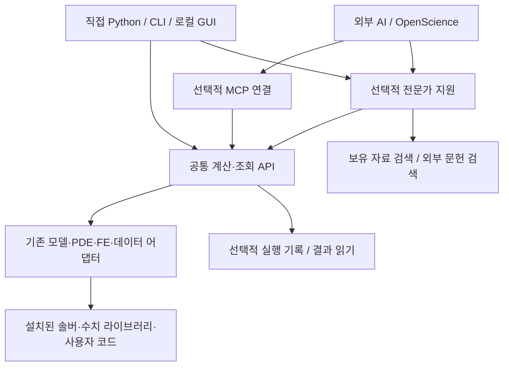
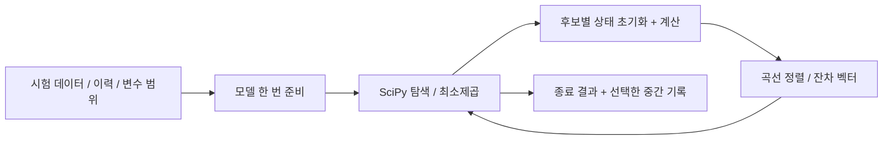
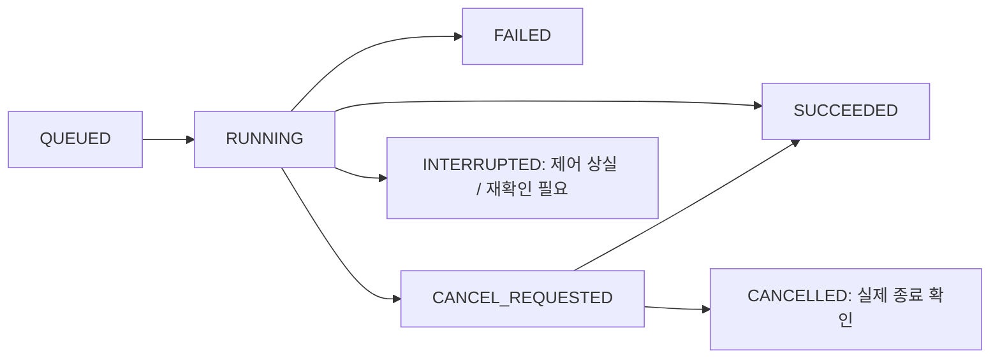
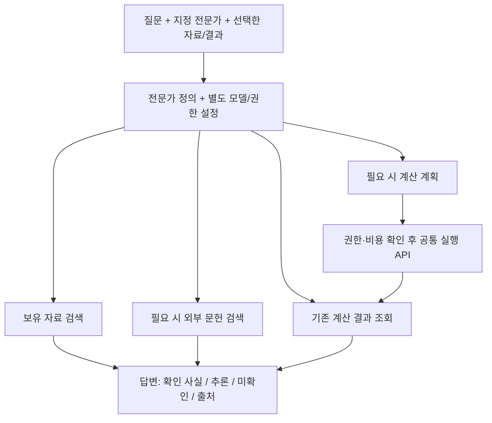
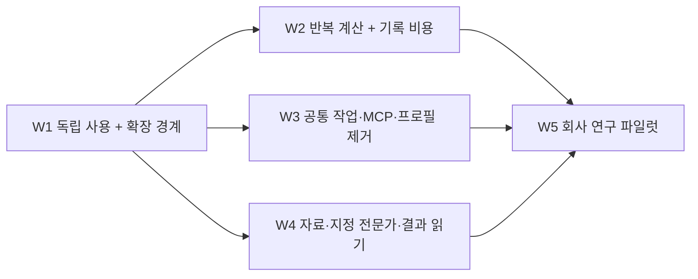

# Autonomous CAE Lab — 통합 설계·구현 명세

**개정 2 · 2026-10-07 · 설계 제안 / 실행 코드 미구현**

개발 기준 경로: `docs/WORKBENCH_REDESIGN.md`. PDF는 이 Markdown의 열람용 출력이다. 이전 재평가 보고서와 짧은 계획서를 동시에 읽지 않아도 된다. 이 문서가 두 문서의 **개발 지시 역할을 대체**한다.

검토한 계산 코드: `main@4843c66e482ded31c59604d7cc19d1800be388f4`. 문서 PR의 확인한 상태: `redesign/research-workbench-20261007`, PR #1, 미병합. 구현 전에 현재 작업 트리와 차이를 확인하되 다시 전체 감사를 시작하지 않는다.

**표기:** ‘현재’는 확인한 기존 코드, ‘목표’는 앞으로 구현할 계약, ‘조건부’는 해당 환경에서 확인 후 선택할 항목이다. 아래 새 API·폴더·검사 이름은 구현 대상이며 지금 사용 가능한 기능으로 읽으면 안 된다. 이 문서는 모든 솔버의 세부 수식을 확정한 문서가 아니라, 제품 전체의 연결 규약과 1차 개편을 실행할 수 있도록 정한 명세다.

## 1. 무엇을 만들고 무엇으로 성공을 판단할 것인가

회사 연구자가 자신의 코드·시험 데이터·해석 모델·문헌을 가져와 직접 계산하고 비교하며, 필요할 때 전문가 AI를 호출하는 **독립형 연구 작업대**를 만든다. 관리 시스템, 새 최적화 엔진, 새로운 에이전트 운영체제를 만들지 않는다. OpenScience·MCP·CAD·Study 등록 중 어느 것도 모든 작업의 필수 선행 조건이 아니다.

| 사용자 요구 | 설계에서 보장할 경로 | 확인할 실제 행동 |
|---|---|---|
| 형상 없는 재료 평가·동정·구성모델 연구 | 메모리 평가 + 기존 재료 라이브러리 연결 | 이력과 계수를 바꿔 응력·상태·접선·에너지를 비교한다 |
| PDE·수치 알고리즘 연구 | 기존 PDE/모델 어댑터, 원래 설정을 유지 | CAD 없이 실행하고 해·잔차·정확도·시간을 비교한다 |
| 구조·접촉·큰 변형·implicit/explicit·손상 | 기존 솔버 입력과 지원 어댑터 | 기존 모델을 실행한다. 미지원 물리는 지원으로 표시하지 않는다 |
| 실험·기존 결과 분석 | 결과/데이터 읽기 API | 솔버를 설치하거나 다시 실행하지 않고 곡선을 비교한다 |
| DOE·최적화·역문제·UQ·민감도·대리모델 | 평가 함수와 수치 라이브러리의 연결 | 설계치수 외에 재료·하중·수치계수를 탐색한다 |
| RAG·논문 검색·지정 전문가·필요 시 협업 | 선택적 전문가 실행과 공통 도구 | 지정한 전문가가 실제 자료를 읽고 출처 있는 답을 준다 |
| 직접 사용·다른 AI 호스트 | Python/CLI, 선택적 GUI/MCP/OpenScience | OpenScience와 MCP를 제거해도 계산·조회는 동작한다 |
| 가벼움·확장성·회사 사용 | 선택 설치, 지연 로딩, 로컬 파일 우선 | 새 기능 때문에 모든 솔버 설치·프로필 복사를 요구하지 않는다 |

다중물리·HPC·시험장비 연계는 이 범위의 확장 대상이다. 첫 구현에서 모두 지원한다고 주장하지 않는다. 위 범위를 지운 채 재료 예제 하나나 CAD 예제 하나를 ‘전체 제품 완료’로 처리하지 않는다.

## 2. 전체 구성과 의존 방향

### 그림 1. 제품 구성 — 화살표는 호출 방향



**핵심 결정:** 계산 코어는 `openscience`, `mcp`, 채팅 모델, 웹 UI를 import하지 않는다. 조회기는 솔버 설치를 확인하지 않는다. 각 상자는 개별 서버나 패키지가 아니라 책임 구분이다. 처음에는 기존 Python 패키지와 로컬 작업 폴더를 사용한다.

| 책임 | 소유 위치 | 맡지 않을 일 |
|---|---|---|
| 물리모델·솔버 입력·응답 의미 | 기존 `caelab/adapters/`와 도메인 코드 | LLM 인증, 전문가 권한, 웹 요청 처리 |
| 직접 평가와 실행 연결 | `caelab/evaluation.py` 목표 추가 | 새로운 수치 알고리즘, 모든 물리를 담는 만능 스키마 |
| 기록 있는 연구 작업 | 기존 `caelab/engine.py`, 저장·캠페인 코드 | 외부 AI 없이는 실행 불가라는 정책 |
| 결과 읽기·선택·비교 | 기존 결과 관련 모듈 + 얇은 공개 진입점 | 조회 때문에 솔버를 다시 시작하는 일 |
| 전문가·자료 검색 | 선택적 `caelab/assist/` | 수치 반복마다 모델 호출, 독자적인 에이전트 OS |
| 사용자 진입점 | 기존 CLI·`apps/lab/`·MCP | 프로필별 공학 예외를 각각 구현하는 일 |

## 3. 기존 저장소와 목표 모듈의 대응

현재 `ModelAnalysisAdapter.solve(output, settings)`와 `PDEAdapter`, `ParameterizedModelAdapter`가 이미 있다. 이를 버리고 동일한 역할의 새 Evaluator 엔진을 만들지 않는다. 기존 `Lab`의 기록 있는 실행과 새 직접 사용 진입점이 **같은 어댑터 실행 본체**를 호출하도록 나눈다. [S1–S3]

```text
caelab/
  __init__.py              [수정] 가벼운 공개 진입점, 선택 모듈은 필요 시 로딩
  contracts.py             [확장] 기존 계약 유지·정리, 빠른 평가 계약만 추가
  backends.py              [추가] 어댑터 목록·factory·지연 로딩, 물리 규칙 없음
  evaluation.py            [추가] prepare/evaluate/run, 기존 실행 본체 재사용
  engine.py                [수정] Study/저장 래퍼, 구체 어댑터 생성 목록 분리
  storage.py               [수정] 결과 읽기·저장·큰 파일 처리 책임 정리
  execution_control.py     [재사용] 실제 자식 프로세스·취소 처리
  optimization.py          [수정] 기록과 평가 호출 분리, 기존 계획 데이터 활용
  optimizers/              [재사용] SciPy DE/LHS + 필요 시 최소제곱 연결
  adapters/                [재사용] 모델 준비/계산/파일 출력의 결합만 분리
  assist/                  [후속] experts / knowledge / literature / host 연결
apps/lab/                  [수정] 기존 화면·HTTP, 계산 규칙 복제 금지
openscience/               [축소] 호스트 연결과 MCP transport
scripts/                   [축소] 설치·실행·검증 진입용, 물리 정책은 넣지 않음
```

이는 필수 파일 수를 늘리라는 지시가 아니다. 같은 책임을 기존 모듈에서 간단히 분리할 수 있으면 그 파일을 사용하고 이 표를 갱신한다. **1차 구현에서 `assist/`, 새 스케줄러, 새 데이터베이스를 미리 만들지 않는다.** 기존 `registry.py`는 연구변수 등록이므로 어댑터 등록과 같은 뜻으로 쓰지 않는다.

### 어댑터 등록 규약

`backends.py`는 `id`, `roles`, `factory`, `optional_dependency`를 보관한다. 목록 조회는 모듈을 import하지 않고 설명만 반환한다. 실제 선택 시 factory를 호출하며 누락된 의존성은 그 어댑터만 사용할 수 없다고 반환한다. 외부 확장은 Python의 표준 entry point 그룹 `caelab.backends`로 등록한다. 코어에 업체별 import를 추가하지 않는다. [E1]

`roles`는 예를 들어 `model`, `pde`, `cad`, `analysis`, `reader`, `prepared`의 지원 기능을 나타낸다. 이것은 권한도, 수치 검증 판정도 아니다. 순수 Python 사용자는 신뢰한 어댑터 객체를 직접 전달할 수 있다. MCP/HTTP에서는 클라이언트가 임의 모듈 경로나 코드를 전달할 수 없고 서버에 등록된 ID만 선택한다.

## 4. 계산 API와 입출력 계약

### 4.1 목표 공개 API

아래는 **구현할 함수 규약**이다. 현재 존재한다고 주장하는 예제가 아니다.

```python
prepare(backend, settings, *, runtime=None) -> PreparedEvaluation

evaluate(backend, settings, *, values=None, runtime=None) -> Evaluation

run(backend, settings, *, output, runtime=None, parent=None) -> dict

read_result(path, *, verify="selected") -> dict

list_backends(*, probe=False) -> list[dict]
```

| 함수 | 동작 | 저장·실행 조건 |
|---|---|---|
| `prepare` | 모델/라이브러리를 한 번 준비하고 반복 평가 객체를 반환 | 빠른 평가를 명시적으로 지원하는 어댑터에만 제공 |
| `evaluate` | 준비 → 1회 평가 → 정리의 편의 함수 | Study·가설·영구 폴더 불필요. 반복 동정에는 쓰지 않음 |
| `run` | 기존 파일 기반 어댑터를 실행 | 호출자가 결과 폴더를 지정. 결과가 임시 폴더 삭제로 사라지지 않음 |
| `read_result` | 저장된 결과와 요청한 응답을 읽음 | 솔버·AI가 없는 환경에서도 동작 |
| `list_backends` | 등록 기능 목록 반환 | 기본은 설치 탐색/실행 없음. `probe=True`일 때 환경 확인 |

현재 `Lab.run_model_analysis(study_id=..., experiment_id=..., backend=..., settings=...)` 등은 기록 있는 경로다. 이를 편의상 유지할 수 있지만 새 API에 가짜 Study나 가설을 자동 생성해서 강제하지 않는다. 공통 검증/정규화와 어댑터 실행 본체를 추출해 두 경로가 공유한다. [S1–S3]

### 4.2 빠른 평가의 계약

```python
class PreparedEvaluation(Protocol):
    def evaluate(self, values: dict[str, float]) -> Evaluation: ...
    def close(self) -> None: ...
```

문맥 관리자 진입/종료를 지원한다. `evaluate_many`와 잔차 Jacobian 제공은 선택 확장이다. 배치 입력의 공통 모양은 `(후보 수, 변수 수)`로 하고 SciPy별 배열 모양 변환은 최적화 연결부 한 곳에서 한다.

**재료 상태 규칙:** 각 후보는 동일한 명시적 초기 상태에서 시작한다. 이력의 시간증분 사이에는 상태가 이어지지만 후보 A의 최종 상태가 후보 B로 넘어가면 안 된다. 준비된 객체의 스레드 공유는 기본 금지하며, 병렬 작업자는 각자의 상태와 모델 핸들을 가진다. 빠른 평가 미지원 어댑터는 명확한 오류를 반환한다. 후보마다 디스크/컨테이너를 생성하는 경로로 조용히 바꾸지 않는다.

### 4.3 입력과 결과의 최소 공통 부분

| 객체 | 필수 내용 | 어댑터에 남기는 내용 |
|---|---|---|
| 실행 입력 | backend, settings, 선택적 변수 값, 실제 runtime 설정 | 원래 솔버 설정, 재료 이력, 경계조건, 초기 상태 |
| 변수 | 이름, 값, 단위, 선택적 범위·변환 | 해당 값이 native 입력의 어느 위치를 바꾸는지 |
| `Evaluation` | execution_status, responses, checks, diagnostics | native 응답과 세부 오류 |
| 응답 한 개 | 종류·값/배열/파일 참조, 단위, 성분, 선택 영역, 집계 방식 | 솔버별 응력·반력·상태변수의 정확한 정의 |
| 곡선·장 | 축 이름·단위·배열 모양 또는 파일/배열 키 | 메시/적분점·절점·좌표계 매핑 |

`responses`의 작은 배열은 메모리에 둔다. 저장할 때 JSON은 설명과 참조만 담고 배열은 기존 적합한 형식으로 저장한다. 큰 장 전체를 MCP 답변에 넣지 않는다. `raw` 결과는 선택적으로 보존해 전문 사용자가 원래 형식으로 내려갈 수 있게 한다.

```json
{
  "execution_status": "SUCCEEDED",
  "responses": {
    "stress_xx": {
      "kind": "series", "unit": "MPa", "component": "xx",
      "location": "material_point", "reduction": "none",
      "axes": [{"name": "time", "unit": "s", "key": "time"}],
      "data_ref": {"file": "arrays.npz", "key": "stress_xx"}
    }
  },
  "checks": [{"name": "physical_calibration", "status": "NOT_ASSESSED"}]
}
```

이 JSON은 **목표 출력의 예시**이며 수치 결과를 제시한 것이 아니다. 실행 성공, 수치 오차, 실제 물성 확인을 한 `PASS`로 합치지 않는다. 기존 결과 스키마에 해당 필드가 있으면 그 필드를 재사용하고 중복 형식을 만들지 않는다. 단위/성분/좌표계 불일치는 기본 비교 오류다. 변환·보간·시간 정렬은 선택한 방법을 기록하며 기본 외삽은 하지 않는다.

## 5. 대표 실행 흐름 — 같은 설계가 다른 연구를 받는가

### 그림 2. 직접 실행과 기록 있는 실행


**흐름 A — 재료 동정:** 여러 시험을 읽고 단위·성분을 맞춘다. 모델을 한 번 준비한다. SciPy에 잔차 함수를 넘긴다. 후보마다 상태를 초기화하고 모든 선택 이력을 계산한다. 최적 계수와 곡선별 잔차를 저장하고 동정에 쓰지 않은 데이터로 비교한다. CAD·OpenScience·MCP를 호출하지 않는다.

### 그림 3. 빠른 수치 루프와 기록의 분리



기본 잔차의 구체적 규약은 다음과 같다. 시험 k의 유효 점 수가 `n_k`, 가중치가 `w_k`, 명시한 응답 스케일이 `s_k > 0`일 때:

```text
r[k,i] = sqrt(w_k / n_k) * (prediction[k,i] - observation[k,i]) / s_k
residual_vector = concatenate(r[k,:] for every fitted test k)
```

결측 마스크와 정렬 축은 탐색 전에 확정한다. 후보마다 잔차 길이를 바꾸지 않는다. 스케일·가중치는 사용자 설정/데이터 준비 단계에서 정하며 단위 혼합을 숨기지 않는다. 최소제곱은 SciPy `least_squares`에 벡터를 전달한다. DE는 목적함수와 제약을 기존 방식으로 연결한다. 실패를 좋은 목적값 0으로 바꾸지 않는다. 최소제곱에서 계산 불가 후보가 나오면 명시적 실패 정책을 적용하며 NaN을 그대로 넘기지 않는다. [E2, E3]

**흐름 B — 기존 PDE/FE 실행:** 지원되는 기존 입력/설정과 실행 경로를 지정 → 해당 어댑터만 환경 확인 → 전용 결과 폴더에서 실행 → 원래 결과와 공통 응답 생성 → 솔버가 없는 환경에서 결과 재열람. 임의 입력덱을 모두 지원한다고 주장하지 않는다. 기존 어댑터가 못 받는 입력은 정확한 한계와 추가 연결 부분을 표시한다.

**흐름 C — 결과만 비교:** 기존 두 결과 또는 시험 CSV → 성분·위치·단위·시간 정렬 → 차이·잔차·그래프 → 선택적으로 저장. 새 해석, 모델 등록, 모든 솔버 검사, AI 인증은 0회다.

## 6. 성능·저장·실행 관리의 구체적 결정

| 구간 | 구현 결정 | 검증할 비용/행동 |
|---|---|---|
| 빠른 반복 | 준비 객체 재사용, 후보별 상태 분리 | 루프 내 LLM 0회, 지원된 메모리 경로의 subprocess/영구 폴더 생성 0회 |
| 최적화 연결 | 현재 SciPy 재사용; serial/batch/process를 명시 선택 | 같은 입력·같은 정확도로 처리량, 시작 비용, 최대 메모리 비교 |
| 캐시 | 준비 객체/한 연구 안에서만 시작 | 고정 설정·이력·초기 상태·모델이 바뀌면 무효. 계수만으로 전역 재사용 금지 |
| 긴 계산 | 기존 프로세스 실행·취소 코드 재사용 | 각 작업 폴더 분리. 계산 전체를 전역 파일 잠금으로 직렬화하지 않음 |
| 병렬 | 작은 로컬 실행기 우선, CPU·메모리 수요 명시 | 작업 수 × 솔버 스레드 수, 데이터 복제량, 실패 격리 확인 |
| 기록 | 단일 실행/전체 탐색 단위로 입력·결과와 선택한 중간 상태 저장 | 수만 후보에 자동으로 수만 실험 폴더를 만들지 않음 |
| 결과 조회 | 요약 우선, 큰 파일은 필요한 부분만 읽음 | read_bytes 전량 복사를 줄이고 재계산을 유발하지 않음 |

현재 DE의 `workers=1`, `vectorized=False`는 실제 코드에 고정돼 있다. 변경은 숫자만 바꾸는 것이 아니다. 로컬 중첩 함수의 프로세스 직렬화, 작업자별 모델 준비, 목적/제약 중복평가, 파일 충돌을 함께 해결한다. SciPy DE에서 병렬/벡터화는 `deferred` 갱신과 연결되며 별개의 실행 방식이다. [S4, E3]

최소제곱의 `workers`는 수치미분 평가의 병렬화 옵션이다. 이를 일반 FE 캠페인 스케줄러로 오해하지 않는다. 서로 다른 설정·병렬 알고리즘에서 후보 순서가 무조건 과거와 같아야 한다는 검사도 만들지 않는다. 최종 응답의 타당성과 선언한 실행 방식의 재현성을 구분한다. [E2]

### 그림 4. 작업 상태 — 요청과 실제 종료를 구분



늦은 취소 요청 전에 이미 완료됐다면 완료로 남긴다. 프로세스가 사라졌는지 확인되지 않으면 CANCELLED라고 쓰지 않는다. 기존 복구 제어가 더 정확한 상태를 갖고 있다면 UI 표현과 매핑하며 또 다른 상태기계를 복제하지 않는다.

**관리 책임:** 1차는 동기 실행이다. 후속 병렬/채팅 작업은 기존 `LabService`의 작업 관리 책임을 UI 바깥으로 분리하여 하나만 사용한다. HTTP와 MCP가 별도 관리자로 같은 작업을 중복 실행하지 않게 한다. 초기에는 한 작업공간의 관리 실행은 한 제어 프로세스가 맡는다. 그 안의 독립 평가 병렬화는 허용한다. 일반 Python 실행은 각자의 결과 경로를 사용한다. 분산 복구·HPC 스케줄러는 이번에 만들지 않는다.

**출처 기록:** 실제 사용한 입력·모델/솔버 버전·계수·이력·난수 설정·중단 이유를 저장한다. 파일 지문은 입력 식별과 중요한 결과 손상 확인에 쓴다. 새 프롬프트나 프로필을 추가할 때 과거 문자열 지문 보존을 요구하지 않는다. 오래된 원본을 읽는 기능과 동일 환경에서 다시 계산하는 기능을 분리한다.

## 7. 전문가·RAG·문헌의 실행 계약

### 그림 5. 지정 전문가의 질문 처리



전문가 정의 예시는 아래처럼 **역할·지식·도구의 조합**이다. 허용 도구 수, 특정 물리 예제, 모델 이름, 과거 해시를 묶은 ResearchProfile로 만들지 않는다.

```yaml
id: materials
label: 재료 연구 전문가
instructions: 재료모델과 시험자료를 검토하고 적용 가정과 근거를 구분한다.
collections: [materials, project-current]
tools:
  - knowledge.search
  - literature.search
  - literature.read
  - results.read
  - calculations.plan
answer_sections: [conclusion, evidence, assumptions, next_check]
```

모델·인증·자료 외부 전송·계산 실행 권한은 별도 실행 설정이다. YAML은 시스템이 신뢰해 읽는 로컬 설정이며 문서 검색 결과가 이 설정을 변경하지 못한다. `@전문가`는 UI가 식별자로 전달하고 사용자가 선택한 전문가를 조용히 바꾸지 않는다.

| 함수의 목표 계약 | 반환 내용/처리 |
|---|---|
| `knowledge.search(query, collections, filters, top_k)` | 문서 ID·버전·페이지/절·본문 구간·검색 점수. 현재 프로젝트 접근 범위 적용 |
| `literature.search(query, providers, filters)` | DOI/제목/저자/연도/원문 후보/어느 provider에서 찾았는지 |
| `literature.read(paper_id, locator)` | 실제 확보한 구간과 접근 상태. 초록/원문/표·그림 확인 구분 |
| `experts.ask(expert_id, question, context, session_id=None)` | 답변·주장별 출처·가정·도구 사용 요약·추가 질문/계산 계획 |
| `calculations.plan(request)` | 실제 지원 backend와 입력·자원·예상 실행 내용. 이 단계에서는 실행 안 함 |

답변의 인용은 `document_id + revision + locator` 또는 `run_id + response selection`에 연결한다. 외부 논문은 DOI가 없으면 provider ID/URL로 구분한다. 새 자료는 임시 자료로 읽을 수 있고, 지식 모음 편입은 별도 사용자 의도로 수행한다. AI 요약을 자동으로 원문 사실로 승격하지 않는다.

**RAG 구현 기본안:** 검색/랭킹을 직접 만들지 않는다. 작은 표본에서는 Haystack의 기존 문서·BM25 구성요소를 사용하고, 임베딩·재정렬은 같은 표본의 근거 검색 품질이 필요로 할 때 추가한다. 첫 버전은 원문과 구간 정보를 로컬에 남기고 인덱스를 재생성 가능하게 한다. 인메모리 검색이 큰 회사 자료까지 충분하다고 가정하지 않는다. 그 한계가 측정되면 저장소만 교체한다. [E4]

**전문가 실행 기본안:** 기존 OpenScience 호스트에서 먼저 공통 도구를 사용하게 한다. OpenScience 없는 내장 AI 실행이 필요한 후속 묶음에서는 기존 Haystack Agent를 우선 연결 시험한다. 도구 호출 루프를 독자 구현하지 않는다. 선택한 로컬/회사 승인 모델의 도구 호출·출처·중단 시험이 통과해야 채택한다. 이 선택은 계산 코어에 영향을 주지 않는다. 두 호스트를 동시에 필수 설치하지 않는다. [E5]

외부 문헌은 현재 호스트의 검색 도구가 충분하면 그것을 재사용한다. 부족한 provider만 얇게 연결한다. arXiv·OpenAlex·Crossref·PubMed/PMC를 모두 처음부터 자체 수집기로 구축하지 않는다. 회사 자료의 외부 검색어/모델 전송은 명시한 정책 범위에서만 허용한다.

## 8. MCP·OpenScience·직접 사용의 관계

| 사용 방식 | 필요한 것 | 없어도 되는 것 |
|---|---|---|
| Python으로 가상 시험·최적화 | 해당 계산 라이브러리/어댑터 | UI, MCP, OpenScience, LLM |
| 저장 결과 비교 | 결과 읽기 구성요소 | 원래 솔버, AI 인증 |
| 로컬 GUI 연구 | 같은 API와 UI | 외부 AI, MCP |
| 외부 AI가 도구 사용 | 기존 MCP SDK + 같은 API | 내부 전문가 모델 |
| 외부 AI가 내부 전문가 호출 | MCP + 선택한 전문가 호스트/모델 | OpenScience 자체는 필수 아님 |
| OpenScience 연구 | OpenScience + 같은 도구 | 별도 자체 오케스트레이터 |

MCP의 목표 도구는 `backends_list`, `calculation_run`, `job_status`, `job_cancel`, `result_read`, `knowledge_search`, `literature_search`, `expert_ask`다. 기존 이름을 그대로 쓸 수 있으면 유지하며 명칭 통일만을 위해 복제하지 않는다. 장기 실행은 작업 ID를 반환하고 상태를 조회한다. 원문/큰 결과는 ID와 요청 범위로 읽는다.

권한 확인은 서버 경계의 한 곳에서 수행한다. 허용된 backend 실행, 허용된 파일 루트, 명시적 자원/비용 제한은 유지한다. 특정 ResearchProfile 이름 때문에 공통 API가 가능한 계산을 MCP에서 거부하는 예외는 제거한다. 직접 Python의 신뢰된 사용자 함수가 원격에서도 임의 코드 실행 권한을 뜻하지는 않는다.

OpenScience는 전문가 호스트 중 하나다. 회사 설치판의 라이선스·인증·배포본은 따로 확인하고, 검증한 소스/배포본을 보관한다. ‘오픈소스이므로 모든 외부 인증도 영구 동작’한다고 가정하지 않는다. MCP도 전송 규격일 뿐이며 실제 클라이언트의 연결 방식은 확인해야 한다. [E6]

## 9. 최소 화면 설계

기존 `apps/lab` 화면을 활용한다. 새 디자인 시스템부터 만들지 않는다. 화면 이름은 조정 가능하지만 다음 정보의 위치와 동작은 구현한다.

```text
┌────────────────────────────────────────────────────┐
│ 작업공간 / 선택한 모델·자료        실행 상태         │
├──────────────┬───────────────────────┬──────────────┤
│ 자료·모델    │ 계산 / 비교 / 결과    │ 전문가 대화  │
│ 기존 파일   │ 입력·단위·조건        │ 선택 전문가  │
│ 결과 목록   │ 곡선·장·오차·로그     │ 출처/도구    │
│ 실행 목록   │ [실행] [중단] [저장]  │ 계산 제안    │
└──────────────┴───────────────────────┴──────────────┘
```

전문가 패널은 꺼도 계산·비교가 동작한다. 파일을 가져오면 Study 작성부터 요구하지 않는다. 실행 버튼은 선택 모델에 필요한 준비 상태만 확인한다. 기존 결과를 선택하면 실행이 아니라 읽기가 일어난다. 결과의 기본 표시는 실제 값·단위·조건·한계이며, 긴 ID·파일 지문·세부 로그는 펼쳐서 본다. 전문가의 계산 제안은 실제 실행 상태와 구분한다.

## 10. 무엇을 유지·이동·삭제할 것인가

| 현재 파일/부분 | 구체적 변경 | 함께 없애거나 바꿀 것 |
|---|---|---|
| `caelab/__init__.py` | 기본 import가 모든 어댑터 초기화를 당기지 않도록 수정 | 기본 import에 솔버/AI 설치가 필요하다는 테스트 전제 |
| `caelab/engine.py` 초기화 | 구체 어댑터 생성 목록을 `backends.py` factory로 이동 | 새 backend마다 코어 생성 목록 수정 |
| `caelab/contracts.py` | 기존 파일 실행 계약에 빠른 평가 선택 계약 추가 | CAD를 모든 평가의 필수 부모로 취급하는 새 코드 |
| 기존 모델/PDE 실행 본체 | 입력 검증·어댑터 호출·결과 정규화와 기록 래퍼 분리 | 새 API에서 기존 solve 코드를 복사하는 방식 |
| `caelab/optimizers/scipy_de.py` | 현재 수치 알고리즘/제약 처리 유지, 일반 변수와 평가 호출 분리 | 최적화가 항상 CAD 변수 효과 PASS 기록을 필요로 하는 결합 |
| `caelab/adapters/mfront_inverse.py` | 모델 준비/이력 평가/목적함수/설치 확인 분리 | E-only를 일반 동정의 영구 입력 규칙으로 사용 |
| `caelab/storage.py` | 큰 파일 스트리밍, 선택 조회, 반복 소스 검사 축소 | 조회 때 실행 환경 동일성까지 무조건 강제 |
| `apps/lab/service.py`, `openscience/jobs.py` | 작업 관리 책임 하나로 통합, 화면·transport는 위임 | 같은 작업공간에 서로 다른 작업 관리 상태 중복 |
| `openscience/mcp_server.py` | 공통 API 호출, 결과/작업 상태 노출 | `optimization_run`의 특정 프로필 이유 실행 거부 |
| `scripts/openscience-research.ps1`, `openscience/native_guard.mjs` | 일반 권한·runtime 설정만 호스트 연결에 남김 | 시나리오별 고정 tool/mesh/model 정의와 복사 descriptor |
| profile 전용 검증 스크립트/테스트 | 대체 경로가 실제 연결된 묶음에서 제거 | 옛 이름·도구 개수·prompt/descriptor 지문 동일성 요구 |
| `AGENTS.md`, README, 누적 계획 문서 | 이 문서 하나를 현재 구현 기준으로 연결 | 매번 모든 ADR 필독, 같은 상태 여러 문서 복제 |

전체 파일을 이름만 보고 삭제하지 않는다. 같은 파일에 있는 경로 접근 보호나 실제 취소 처리는 재사용한다. 과거 개발 결과의 영구 호환 계층은 만들지 않는다. 사용자 자료와 미커밋 작업은 자동 삭제하지 않는다. 정리가 필요한 과거 기록은 삭제 목록을 한 번 확인하고 처리하며, 이를 매 기능의 새 승인 절차로 만들지 않는다.

## 11. 외부 기술 선택 — 이번에 정한 것과 미룬 것

| 영역 | 기본 결정 | 바꾸는 조건 |
|---|---|---|
| 수치 계산·DE·LHS·최소제곱 | NumPy/SciPy 재사용 | 필요한 알고리즘이 없거나 수치 성능/제약 요구가 맞지 않음 |
| 모델/솔버 | 기존 어댑터·Code_Aster/OpenRadioss/FEniCSx/MFront 등 | 실제 지원 범위/실행 환경 문제에 맞춰 연결 개선 |
| 플러그인 발견 | 표준 Python entry point | 특수 배포 요구가 확인되기 전 독자 플러그인 OS 금지 |
| 로컬 실행 | 기존 실행 제어 + 표준 실행기 우선 | 실제 다중 기계·장기 복구 요구가 생기면 전문 도구 비교 |
| 검색·내장 전문가 | Haystack 구성요소 우선 연결 시험 | 실제 문서·승인 모델로 품질/비용/호환 문제가 확인됨 |
| MCP | 현재 공식 SDK 사용 | 필요한 transport와 실제 클라이언트로 검증 |
| 개발 도움 | 기존 grill-me·검색 우선·리뷰 도구를 필요 시 사용 | 부족한 행동이 실제로 확인될 때만 최소 맞춤화 |

GEMSEO·OpenMDAO·AiiDA·Parsl·pymoo·SALib 등을 이 표에 전부 필수 의존성으로 추가하지 않는다. 연성·미분·UQ·원격 작업 등 구체 요구가 발생했을 때, 필요한 사용자 코드와 실행 부담을 줄이는지 비교한다. 기존 SciPy 연결을 버리고 새 프레임워크를 쓰는 것 자체는 성과가 아니다.

버전 잠금은 검증 환경을 재현하기 위해 패키지/환경 파일에 남긴다. 특정 개발 컴퓨터의 바이너리 지문을 모든 회사 설치의 허용 조건으로 쓰지 않는다. 문서에 적은 후보가 현재 환경에서 설치·성능 검증됐다는 뜻은 아니다.

## 12. 구현 순서와 구체적 완료 조건

### 그림 6. 의존 순서 — 전문가를 마지막까지 무조건 미루지 않음



한 번의 작업은 아래 기능 묶음으로 진행한다. 개별 버그마다 새 설계 문서·프로필·감사 프로젝트를 만들지 않는다. 공통 계약 변경은 한 담당자가 통합하고, 다른 작업은 겹치지 않는 파일에서 진행한다.

### W1 — Codex가 지금 착수할 묶음

**결과물:** 가벼운 설치, 지연 로딩, 직접 평가·기록 실행·독립 조회, 새 backend 확장 예시.

1. 기준 브랜치와 미커밋 작업을 확인한다. `contracts.py`, `__init__.py`, `engine.py` 초기화와 모델/PDE 실행 본체, CLI·의존성 파일을 읽는다. 기존 helper 위치를 확인하고 공통 실행 본체를 재사용한다.
2. `pyproject.toml`에 현재 실제 의존성을 옮기고 선택 기능을 분리한다. 기본 import/결과 읽기는 CAD·LLM·MCP 설치를 요구하지 않는다. 솔버 네이티브 패키지는 pip extras에 존재하는 것처럼 꾸미지 않고 runtime 설정으로 구분한다.
3. 어댑터 factory를 지연 로딩한다. 기존 `Lab` 생성과 공개 목록 조회가 선택하지 않은 backend를 초기화하지 않게 한다.
4. 4절의 직접 `run/read_result`와 빠른 `prepare/evaluate` 진입점을 연결한다. 준비 객체를 지원하지 않는 기존 adapter는 솔직하게 미지원으로 표시한다.
5. 신뢰된 사용자 함수 하나를 확장 방식으로 연결하고 기존 재료 또는 PDE/FE 어댑터 하나도 같은 공개 경로에서 사용한다. 시험용 함수를 연결한 사실을 네이티브 솔버 검증으로 대체하지 않는다.
6. 다음 세 사용 경로와 실패 조건을 실제로 확인하고 결과를 제출한다. API/CLI 도움말·README의 필요한 부분만 갱신한다.

| 제안 테스트/데모 | 통과 조건 |
|---|---|
| `test_import_without_optional_backends` | 별도 프로세스에서 import/목록 조회 시 CAD·MCP·AI 모듈 초기화 0회 |
| `test_direct_function_evaluation` | Study·영구 파일 없이 사용자 함수 입력→배열 응답. 직접 호출과 값 일치 |
| `test_backend_extension_without_core_edit` | 외부 확장 하나를 등록해 실행. PS/JS/코어 어댑터 목록 수정 없음 |
| `test_record_read_without_runtime` | 저장 결과를 원래 솔버 없이 읽음. 실행·설치 탐색 없음 |
| `test_prepared_state_isolation` | 후보 A→B→A 응답이 A 단독 결과와 일치. 이력 간/후보 간 상태 규약 유지 |
| `demo_existing_native_backend` | 설치된 기존 backend 하나를 공개 API로 실제 실행·재열람. 미설치면 그 검증만 미실시로 남김 |
| 오류 확인 | 누락 의존성·잘못된 입력·단위 불일치·지원 안 하는 빠른 경로를 구분해 설명 |

위 이름은 목표 테스트 이름이다. 동일 목적의 기존 테스트가 있으면 수정·재사용한다. W1 완료는 폴더와 빈 클래스 생성이 아니라 위 행동으로 판정한다. 특정 native 환경이 없으면 가능한 독립 코드는 진행하되 그 실행을 확인했다고 쓰지 않는다.

### W2 — 반복 계산과 성능

`optimization.py`, SciPy 연결, 재료 준비 코드, `storage.py`를 수정한다. 같은 모델을 직접 호출한 기준과 작업대 경로를 비교한다. `cold_start`, `prepare`, `evaluate`, `record`, `read`, 최대 메모리, 파일 수, subprocess 수를 분리한다. 배치/병렬은 상태 초기화와 동일 응답 확인 후 허용한다. 수치/실패 처리 기준을 낮춰 속도 향상으로 만들지 않는다. 실제 측정 전 목표 밀리초/배수는 만들지 않는다.

### W3 — 연결과 불필요한 프로필 제거

MCP와 GUI가 같은 API·권한·작업 관리자를 사용하게 한다. 권한상 동등한 직접/API/MCP 요청은 같은 계산을 선택할 수 있어야 한다. 프로필 정의·복사 guard·전용 지문 테스트는 **대체된 책임과 함께 제거**한다. 고정 CAD 조건 실행 예외 제거, 장기 작업 ID/중단, 결과 범위 조회를 확인한다. 종료 확인과 파일 접근 보호는 유지한다.

### W4 — 자료·지정 전문가

자료 검색·문헌·결과 읽기 계약을 연결하고 전문가 하나를 지정 호출한다. 자료에는 원문 구간이 포함되어야 한다. 최소 확인 사례는 근거가 있는 질문, 근거가 없는 질문, 서로 상충하는 자료, 초록만 확보한 논문, 다른 프로젝트 접근 거부다. 실제 모델/호스트 호출을 하지 않은 mock 결과는 AI 기능 검증이 아니다. 다른 전문가와의 협업은 단일 전문가 경로가 동작한 뒤 필요한 경우 추가한다.

### W5 — 회사의 서로 다른 연구 두 가지

재료/데이터 중심 한 작업과 기존 PDE/구조/explicit 중 한 작업을 선택한다. 입력부터 실행·비교·자료 검색·재열람까지 확인한다. 전문가 없이도 가능한 계산 경로와 전문가가 기여한 부분을 구분한다. 설치/새 연구 시작에 필요한 단계, 실행시간, 오류 복구, 수동 작업 감소를 실제로 비교한다. 모든 자료 이관이나 전사 시스템 구축은 선행 조건이 아니다.

## 13. Codex에 전달할 시작 지시와 문서 운영

> `docs/WORKBENCH_REDESIGN.md`의 전체 구성과 W1을 읽고, 현재 브랜치·미커밋 변경을 확인한 뒤 W1을 구현하라. 기존 파일 실행 계약과 수치 구현을 재사용하라. 새 Study/Evaluator 프레임워크나 스킬·스케줄러를 만들지 말라. 직접 함수 평가, 기존 backend 실행, 솔버 없는 결과 읽기라는 서로 다른 경로를 함께 확인하라. 작업 도중 발견한 작은 문제는 해당 묶음 안에서 해결하고, 과거 프로필 지문 보존을 목표로 삼지 말라. 계약을 바꿔야 하면 변경 이유와 영향을 이 문서에 짧게 반영하라. 끝날 때 실제 실행 예제, 변경·삭제 파일, 검사 결과, 미확인 환경을 보고하라. main에 임의 병합하지 말라.

개발자가 구현 세부를 판단할 수는 있지만 제품 구조를 임의로 바꾸지는 않는다. 새로운 범용 기반을 직접 만들기 전에는 저장소와 외부 라이브러리를 조사하고, 재사용이 더 복잡한 경우 그 이유를 해당 변경에 짧게 남긴다. 작은 버그마다 전체 인터뷰/라이브러리 비교를 반복하지 않는다.

`AGENTS.md`는 현재 원칙과 이 파일의 링크, README는 사용자 진입 안내만 가진다. 진행 상태는 PR에서 보고한다. PDF·옛 보고서·여러 상태문서에 같은 진도를 복사하지 않는다. 설계는 변경 가능하며 문자열·파일 지문으로 영구 고정하지 않는다.

## 확인 자료와 남은 결정

**이번 문서는 소스 검토와 설계 보완이다.** API 구현, 라이브러리 도입, 네이티브 실행·성능 검증을 수행한 것으로 표시하지 않는다. 회사 승인 모델/외부 전송 범위, 실제 native 실행 환경, 고급 UQ/HPC 요구는 사용 시점에 확정한다. 이 미결정 항목들은 W1의 독립 사용 설계를 막지 않는다.

[S1] 기존 계약: https://github.com/pikachu444/autonomous-cae-lab/blob/4843c66e482ded31c59604d7cc19d1800be388f4/caelab/contracts.py

[S2] 현재 공개 import: https://github.com/pikachu444/autonomous-cae-lab/blob/4843c66e482ded31c59604d7cc19d1800be388f4/caelab/__init__.py

[S3] 현재 초기화와 모델 실행: https://github.com/pikachu444/autonomous-cae-lab/blob/4843c66e482ded31c59604d7cc19d1800be388f4/caelab/engine.py

[S4] 실제 SciPy 연결: https://github.com/pikachu444/autonomous-cae-lab/blob/4843c66e482ded31c59604d7cc19d1800be388f4/caelab/optimizers/scipy_de.py

[S5] 기존 문서 변경 PR: https://github.com/pikachu444/autonomous-cae-lab/pull/1

기존 프로필·MCP 예외·재료 동정·저장 관련 파일의 처분은 앞서 제공한 보고서의 해당 코드 검토를 이어받은 설계다. 이번 재확인에서 위 S1–S4와 PR 상태를 읽었다. 모든 파일을 다시 전수 검증했다고 주장하지 않는다.

[E1] Python 표준 entry point: https://packaging.python.org/en/latest/specifications/entry-points/

[E2] SciPy 최소제곱: https://docs.scipy.org/doc/scipy/reference/generated/scipy.optimize.least_squares.html

[E3] SciPy DE: https://docs.scipy.org/doc/scipy/reference/generated/scipy.optimize.differential_evolution.html

[E4] Haystack BM25: https://docs.haystack.deepset.ai/docs/inmemorybm25retriever

[E5] Haystack Agent: https://docs.haystack.deepset.ai/docs/agent

[E6] MCP 전송: https://modelcontextprotocol.io/specification/latest/basic/transports

외부 문서는 2026-10-07 조회했다. 문서에 존재하는 기능과 실제 설치판의 호환성을 구분한다. RAG·에이전트 선택안은 W4 연결 시험 전까지 조건부이며, 전체 코어를 특정 라이브러리에 묶지 않는다.
