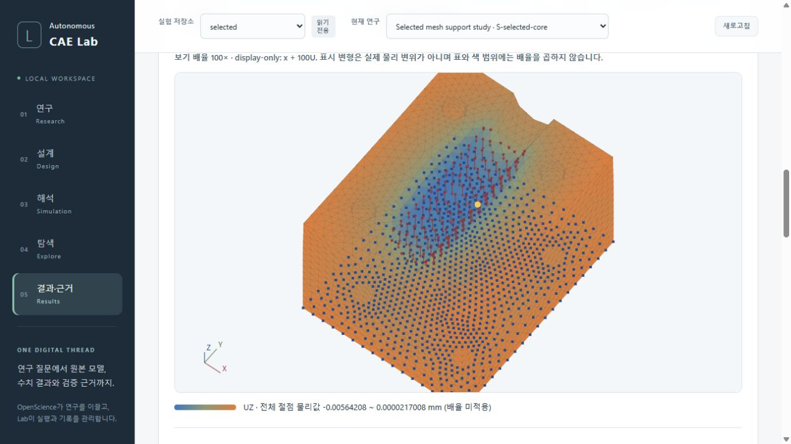

> Historical actual UI source67caf04; retained native producerce12037. This initial view requires the P2 correction described below. It is not a current visual-usability PASS.

# Independent actual-pixel usability assessment

**Verdict: CORRECTION_REQUIRED_FOR_BOUNDED_PIXEL_USABILITY — 0 P1 / 1 P2.**

The captured view is useful for confirming that the retained mesh has a displacement field, a selected native node and a physical-value legend. It is not yet a clear view of where the support is restrained: the always-visible restraint layer covers the front-facing colored surface and competes with the load cues. Correct this display ambiguity before claiming the bounded CAE visual-usability gate passed. No numerical or native-evidence failure was found or inferred.

## Evidence and limits

This is the requested independent Astra/high assessment of actual usefulness. Root integrated the seven reviewed files at UI source `67caf04f85bfdfe93446a080bb093f5ebdee5941`; the retained native data remain producer `ce120378ee8da570a779f985cfc745bf0340c6ce`, single-support selected4mm. Research model remains the approved5.6Sol/ChatGPT route.

I viewed the actual complete-canvas capture `fixture-full-field-gui-live-root-01/DEFORMED-UZ-100X-GUI-02.jpg` (86,647bytes; SHA-256 `fada28688ce46a0103969ee03d053b6ceca16b01c26123da8ec44e5f35c7ee24`). The earlier partial capture01 is not used for this verdict. I read START-01, the separate MAGNITUDE-ZERO-SCALE-DOM-01 and VERIFICATION-DETAILS-AX-01, and reused the frozen source review. The |U|/factor0 DOM is a later state than the UZ/100x screenshot; it is not presented as text visible in that screenshot.

All seven current Main files match the previous frozen seven hashes. The previous FREEZE/MANIFEST/RECEIPT and source-review report/receipt seals remain unchanged. The before/after pin files cover23 exact inputs. Pin capture follows initial read-only orientation and image viewing. No browser/runtime/HTTP/Git/native/mesh/provider/auth calls, product imports or tests were performed. No source or historical evidence was edited. UI commit/push/clean state and live interaction provenance are Root's supplied/saved facts, not newly queried Git or browser facts.

The earlier `BOUNDED_SOURCE_REVIEW_PASS` remains a sealed historical source verdict. This new actual-pixel gate adds a usability finding grounded in the displayed image and its matching source. It does not change physical metrics, validation thresholds, selected-mesh limitations, seven blocking UNKNOWNs, or NOT_RELEASED.

## P2: Unlabeled through-surface restraints obscure and mislocate the apparent support

**File:** `apps/lab/static/fixture-field-viewer.js`, **lines57–65** (primary anchor57). Related controls/caption: lines114–122; related selection path: lines89–94.

In screenshot02, dense blue squares spread across much of the visible orange body and overlap the central red saddle arrows. The source explains the image: it finishes painting the filled exterior triangles at lines53–56, then draws every fixed node and every load on top, without checking whether the node/arrow is behind a surface. The retained fixed set belongs to the bottom plane, but there is no X-ray/hidden-node notice or independent layer toggle. A user can therefore read the blue pattern as restraints distributed over the visible side/upper surface; it also obstructs the displacement contour. Calling them fixed XYZ points does not explain that they are projected through solid geometry.

This is a material usability/interpretation defect, not corrupt native BC data. No claim is made that a particular user has already misinterpreted it. The matching source also considers all boundary nodes for click selection; depth breaks only an exact screen-distance tie (lines92–93). A hidden boundary node can consequently compete with a visible one. This is a related source risk to address with the same visibility policy, not an observed mispick in the supplied screenshot or a separately counted P2.

**Required bounded correction:** provide independent restraint/load layer controls and make overlay visibility explicit. Prefer visible-surface cues by default, with depth-aware marker/arrow visibility and selection based on the same displayed surface. Offer an optional, clearly labeled X-ray mode for hidden BC/load inspection. If the first bounded implementation retains through-surface drawing, it must be an explicit opt-in inspection mode with an adjacent persistent warning; keep a clean contour view available by default and do not imply that its hidden-node picking selects the visible surface. A short general disclaimer elsewhere on the page is insufficient.

Keep all1,057fixed and123loaded native records and raw vectors intact. Visibility filtering is a display choice, not permission to alter the field or invent representative forces. Show counts and the selected display policy so absence of a marker is distinguishable from absence of a BC/load. Preserve exact-ID access to every node, including an explicitly identified hidden/interior probe. Do not silently decimate loads or rename a subset as the complete load distribution.

## What the supplied evidence supports

- The captured mesh silhouette, triangular exterior and a spatial variation in UZ color are recognizable. The scalar bar states UZ/mm and the unscaled physical range; the100x note explicitly says display-only. A yellow selected-node cue and XYZ orientation triad are visible.
- The separate actual DOM records whole-field |U| range0..0.006169333909086347mm at factor0, and probe314 retains XYZ `[4.15,0,26]`, U `[-2.49550E-03,9.69048E-06,-5.64208E-03]`mm and force `[0,0,-0.546711588795]`N. Its table row agrees. This supports text/value fidelity; the screenshot does not show the table's rendered layout.
- Actual verification details name the correct child/parent/revision, adapter6, ce native producer, field SHA/bytes and five native source pins. SOURCE/AX evidence is not used to claim unseen pixel readability.
- UNKNOWN/NOT_RELEASED and sensitivity-unassessed are present in the actual DOM. They remain separate from physical accuracy, stress qualification, mesh independence and release.

The screenshot shows the body reaching the canvas edges at this captured camera/zoom. That motivates a fit-view check; the camera history is not recorded here, so this is not evidence of a broken default camera. No frame rate, interaction latency, keyboard accessibility, small-screen readability,2mm/full-envelope performance or actual erroneous pick can be inferred from this still.

## Prioritized correction and acceptance plan

1. **Close P2 before pixel PASS.** In the existing viewer, add independent mesh-edge/restraint/load controls, a visible overlay-mode caption and a clean displacement view. Default to visible-surface semantics; an explicit X-ray inspection option is useful for checking the bottom set. Make click picking follow the same visibility mode. If an exact-ID probe is hidden, identify it as hidden instead of drawing an unexplained apparently visible marker. Reuse current current-record/epoch/destroy guards for every new control.

2. **Verify the visibility policy with focused source controls.** Root/writer should use small front/back overlapping triangles and two nearby projected native nodes: a rear marker must not appear as a visible restraint, and a front-surface click must not silently choose the hidden candidate in visible mode. Exercise rotation, deformation and mode changes; explicitly test X-ray labeling if supported. Layer toggles must not change arrays, physical ranges, probe values, counts, metrics or saved data. This reviewer has not run those controls.

3. **Recapture this same retained field.** Root should capture a clean UZ view, restraints alone after rotating to the bottom, saddle loads alone from a useful angle, and any explicit X-ray mode. In normal mode, solid surfaces must not be covered by unlabeled rear-restraint squares; in X-ray mode, the visible notice must make hidden markers unambiguous. Confirm the load direction and distinguish the support bottom from the saddle. Use the same fieldSHA/revision and preserve original native bytes; no CAD/remesh/solver/provider/global-sweep run is necessary.

4. **Repeat a small interaction check.** Confirm probe314 by exact ID and one known visible node by clicking; check that rotation/overlay changes cannot confuse front/hidden selection. Toggle UX/UY/UZ/|U| and0/100x: the raw U/force and unscaled physical extrema remain unchanged. Retain the same-result late success/error/store-change guard checks for added callbacks. Capture the probe/table rendered together with useful context; current DOM alone does not establish their pixel layout.

5. **Small usability improvements after the P2 path is fixed.** Add a fit-to-view action that uses the currently displayed coordinates and visible cue extents with margin; do not reset the user's camera on every component change. Keep overlay controls, compact physical legend and selected-node readout close to the canvas. A concise legend such as `UZ −5.64208e−3 … 2.17008e−5 mm` avoids unnecessary binary64 text length, while native precision remains in the probe/table/download. Let mesh edges be switched off to inspect the color pattern. These are bounded improvements, not independently established P2 failures.

6. **Keep acceptance proportional.** One representative captured interaction on this7,715-node field can close the bounded retained-field visual gate after correction. Do not claim a measured40k-node limit,2mm full-U,7body display, Research/S3/U1/all52 or engineering completion from it. No mandatory model-wide sensitivity/convergence sweep belongs in this display correction.

The output packet is private/local-only. No previous source or native seal is replaced; the new P2 is tracked here for Root's correction and a new actual-pixel acceptance record.
